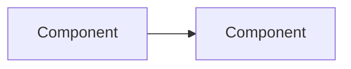

# Lesson Title

## What you will design

State the artifact or production capability the learner will complete.

## The production problem

Begin with a concrete user or operational failure. Do not begin with a framework API.

## Core mechanism

Explain:

- what the concept is;
- which responsibility it owns;
- which responsibility it does not own;
- how it changes the architecture;
- which tradeoff it creates.

## Reference architecture

Include a text explanation and trust/authority boundaries.

## Atlas application

Show the state, interface, or sequence the learner will implement. Prefer typed examples.

## Tradeoffs

| Choice | Benefit | Cost | Use when |
|---|---|---|---|
| | | | |

## Failure injection: name the failure

Describe:

- initial symptom;
- hidden cause;
- experiment;
- expected trace/state/effect evidence;
- safe recovery criterion;
- permanent regression test.

## SHIP: build milestone

List concrete implementation and acceptance requirements.

## RUN: prove the production property

Require a controlled failure and retained evidence.

## DESIGN: interview drill

Provide one system-design prompt and the dimensions a strong answer covers.

## Check your understanding

1. Mechanism question.
2. Boundary question.
3. Failure question.
4. Tradeoff question.
5. Measurement question.

## Primary references

Use official documentation, standards, or original engineering publications. Record the review date in the course source map when implementation-sensitive details change.
