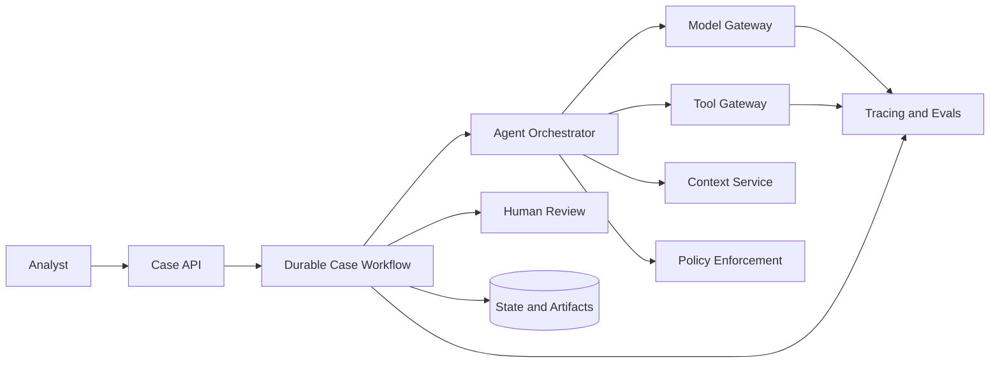

# How to Design an Agentic System

## What you will design

By the end of this module, you will have a one-page architecture brief for Atlas and a repeatable method for any agentic-system-design question.

## The production problem

Most agent demos begin with a model and a few tools. Production design begins somewhere else: a user outcome, a failure consequence, and a boundary around what the system is allowed to do.

“Build an onboarding agent” is not a design requirement. It hides the questions that determine the architecture:

- Is the agent gathering evidence, recommending a decision, or making it?
- Which source is authoritative?
- How fresh must a result be?
- Can a case wait for a document for two weeks?
- What happens after a worker crash?
- Can a retry send the same email twice?
- Who may see the case?
- How will the team know a model change made the system worse?

An excellent AI engineer makes these questions explicit before selecting a framework.

## The course model

A useful abstraction is:

```text
Production agent =
    probabilistic decision component
  + deterministic control plane
  + trusted tool and data boundaries
  + durable state
  + evaluation and operations
```

The model proposes. The application validates, authorizes, records, executes, observes, and recovers.

This distinction prevents a common design error: assigning software responsibilities to natural-language instructions. “Do not call this tool twice” is weaker than idempotency. “Only use authorized records” is weaker than an ACL-filtered retrieval layer. “Ask for approval” is weaker than a workflow state that cannot transition without an authenticated decision.

## The RUNTIME method

Use the course design method in this order:

### R: Requirements and risk

Define the user, outcome, success metric, constraints, non-goals, and worst credible failure.

For Atlas:

- User: counterparty risk analyst.
- Outcome: a cited, reviewable evidence packet.
- Non-goal: final onboarding approval or rejection.
- High-consequence failure: missing a sanctions match, exposing another tenant’s data, or publishing unsupported claims.

### U: User journey and authority

Walk through intake, research, missing information, synthesis, review, publication, correction, and cancellation.

Classify every action:

- read-only;
- reversible write;
- external side effect;
- material or irreversible decision.

### N: Nodes and topology

Choose the simplest control flow that works. Atlas may begin as a deterministic sequence with one bounded research loop. It does not need six “personality” agents.

### T: Tools, context, and data

Define contracts, identity, access, side effects, timeouts, retries, provenance, and freshness.

### I: Integrity, identity, isolation, and governance

Draw trust boundaries. Untrusted webpages, uploaded files, model output, and tool output do not become trusted merely because they are placed inside a prompt.

### M: Memory and durable execution

Separate what the agent remembers from how the workflow survives. A case waiting for a document needs durable execution. A preference retained across cases is long-term memory. They are different systems.

### E: Evals, economics, observability, and evolution

Define how quality, safety, latency, cost, and rollout will be measured before choosing a model.

## A first Atlas architecture



This diagram is intentionally coarse. In an interview, the first diagram should establish responsibilities and trust boundaries. Add detail only where the constraints demand it.

## The architecture decision sequence

When a requirement appears, turn it into a system consequence.

| Requirement | Architecture consequence |
|---|---|
| Cases can wait 30 days | Durable workflow, external signals, persisted timers |
| Final decision must be human | Approval state enforced outside the model |
| Sources contain untrusted text | Instruction/data separation and prompt-injection controls |
| Evidence must be auditable | Claim-level provenance and immutable versioned artifacts |
| Duplicate requests are possible | Idempotent intake and side-effect deduplication |
| Multiple business units | Tenant-scoped identity, storage, retrieval, and telemetry |
| Model changes frequently | Versioned prompts/models and regression gates |
| P95 under 10 minutes | Parallel safe reads, queues, time budgets, and fallbacks |

System design is the act of making these translations.

## Failure injection: the impressive demo

A team builds Atlas as one chat endpoint. The system prompt says:

> Search all sources, make a recommendation, and email the analyst when done.

The demo works. In production:

1. A registry API times out.
2. The process restarts.
3. The agent repeats the whole run.
4. The email is sent twice.
5. One retrieved article contains instructions to ignore prior policy.
6. The final response has no claim-level citations.
7. No one can determine which model and policy versions produced it.

The failure is not “the model hallucinated.” The system omitted runtime, effect, trust, and audit design.

## SHIP: create the first design canvas

Complete these sections for Atlas:

1. Outcome and non-goals.
2. Risk tier and worst credible failure.
3. Allowed and prohibited authority.
4. First architecture diagram.
5. Five measurable success criteria.
6. Three open tradeoffs.

Suggested success criteria:

- percentage of packets with all mandatory evidence classes;
- citation correctness;
- sanctions-source freshness;
- human correction rate;
- P95 completion time;
- median cost per case;
- unauthorized-action rate.

Do not choose a framework yet.

## RUN: review the design under pressure

Change one assumption:

> Atlas must now support a case that waits 30 days for a beneficial-ownership document.

Write down every component that changes. A good answer mentions at least:

- durable workflow state;
- wait/signal handling;
- pending-approval or pending-document status;
- timers and escalation;
- case cancellation;
- workflow versioning;
- data retention;
- user-visible progress.

## DESIGN: interview drill

**Prompt:** Design an AI agent that prepares counterparty due-diligence packets for bank analysts.

Spend five minutes clarifying, then present:

1. user and outcome;
2. non-goal;
3. risk and authority;
4. high-level architecture;
5. one likely failure and control.

## Check your understanding

1. Why is “the model should remember” insufficient for long-running work?
2. Which Atlas requirement most strongly justifies a durable workflow?
3. Name one control that must live outside the prompt.
4. What is the difference between an eval metric and an SLO?
5. Why should the first architecture diagram remain coarse?

## Primary references

- [OpenAI Agents SDK](https://openai.github.io/openai-agents-python/)
- [Anthropic: Building Effective AI Agents](https://www.anthropic.com/engineering/building-effective-agents)
- [Temporal: Understanding Durable Execution](https://docs.temporal.io/evaluate/understanding-temporal)
- [NIST AI Risk Management Framework](https://www.nist.gov/itl/ai-risk-management-framework)
