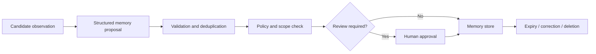

# State, Sessions, and Memory

## What you will design

You will separate operational state, conversation state, durable workflow history, long-term memory, enterprise knowledge, and audit history.

## “Memory” is overloaded

Teams often use one word for several distinct systems:

- the messages in a chat;
- the current run’s scratch state;
- a checkpoint used to resume execution;
- facts retained across sessions;
- retrieved enterprise documents;
- a workflow event history;
- an audit log.

Combining them creates incorrect retention, access, and recovery behavior.

## Six storage responsibilities

### 1. Request state

Exists for one API request:

- authenticated caller;
- request ID;
- deadline;
- locale;
- client capabilities.

It should not become long-term memory by accident.

### 2. Run state

Tracks one agent execution:

- iteration;
- current plan;
- evidence found;
- unresolved gaps;
- budgets;
- pending action.

Run state may be checkpointed.

### 3. Thread or session state

Maintains continuity across multiple user interactions:

- conversation turns;
- current case;
- summaries;
- pending questions.

A session is a scope and identifier. It is not automatically a memory strategy.

### 4. Durable workflow history

Records events needed to restore progress and correctness:

- workflow started;
- activity scheduled;
- tool effect completed;
- timer fired;
- approval received;
- state transition.

This exists to resume work, not to personalize future answers.

### 5. Long-term memory

Persists selected information across threads or cases:

- a user’s preferred report format;
- a reviewed entity alias;
- an organization-specific interpretation approved by policy owners;
- a prior incident lesson.

Memory is an application feature and an attack surface.

### 6. Enterprise knowledge and system of record

Policies, cases, registry snapshots, documents, and official decisions belong in governed data stores. They should be retrieved, not “remembered” as opaque model history.

## Memory types

A useful conceptual taxonomy:

### Semantic memory

Facts:

- “This analyst prefers concise summaries.”
- “ABC Holdings is an approved alias for entity 123.”

### Episodic memory

Past experiences:

- “In case 456, this source produced a false positive.”
- “The previous ownership conflict was resolved using a notarized filing.”

### Procedural memory

Rules or methods:

- “When entity names conflict across jurisdictions, query the official registration ID first.”

Procedural memory can behave like policy. It therefore needs strong review and versioning if it affects consequential work.

## A memory record

```python
class MemoryRecord(BaseModel):
    memory_id: str
    tenant_id: str
    subject_id: str
    type: Literal["semantic", "episodic", "procedural"]
    content: dict
    provenance: list[str]
    created_by: Literal["human", "system", "agent_proposal"]
    approved_by: str | None
    confidence: float | None
    valid_from: datetime
    expires_at: datetime | None
    supersedes: str | None
    sensitivity: str
    retrieval_tags: list[str]
```

The record needs provenance, scope, lifecycle, and ownership, not only an embedding.

## Memory writes are privileged

An agent that can write memory can influence future runs. A malicious source or incorrect inference can persist beyond the original case.

Use a write pipeline:



Good defaults:

- do not store raw conversations automatically;
- store structured facts rather than prose;
- require provenance;
- scope by tenant and subject;
- use TTLs where appropriate;
- allow correction and deletion;
- distinguish proposed from approved memory;
- never let untrusted source text directly become procedural memory.

## Retrieval from memory

Memory retrieval should be task-specific and authorization-aware.

Questions:

- Does this memory apply to this tenant?
- Does it apply to this subject?
- Is it still valid?
- Is it relevant to the current step?
- Does it conflict with an authoritative source?
- Is the model allowed to see it?
- Should it influence action or only presentation?

Memory should lose to an authoritative current source unless policy explicitly says otherwise.

## Managing long conversations

Keeping every message creates cost and distraction. Options:

- trim low-value turns;
- retain only structured state;
- summarize closed portions;
- store artifacts outside the message list;
- retrieve prior facts on demand;
- split subtasks into isolated contexts;
- ask the user to reconfirm stale consequential information.

A summary should include:

- what was decided;
- supporting artifact IDs;
- unresolved questions;
- pending commitments;
- version and timestamp.

Avoid summaries that erase uncertainty.

## Checkpointing vs event history

A checkpoint stores a snapshot. An event history stores the ordered facts from which state can be reconstructed.

Tradeoffs:

| Approach | Strength | Risk |
|---|---|---|
| Snapshot checkpoint | Fast resume, simple | Harder to audit transitions; version compatibility |
| Event history/replay | Detailed audit and resilient reconstruction | Determinism constraints; history growth |
| Hybrid | Efficient and auditable | More implementation complexity |

The course later uses a durable workflow runtime for event-based execution. A graph checkpointer may be sufficient for shorter interrupt/resume flows.

## Data lifecycle

Design memory lifecycle before launch:

- creation;
- use;
- correction;
- supersession;
- expiration;
- legal hold;
- export;
- deletion;
- downstream removal from indexes and caches.

“Delete from the database” is incomplete if the item remains in a vector index, trace, cache, evaluation dataset, or model prompt archive.

## Failure injection: poisoned alias

An untrusted article incorrectly calls “ABC Trading LLC” a subsidiary of a sanctioned entity. Atlas stores the relationship as memory. Future cases retrieve it as a fact, turning one bad source into a persistent false positive.

Controls:

- external evidence cannot directly write approved memory;
- memory proposal includes provenance and confidence;
- high-impact relationships require human approval;
- authoritative sources override memory;
- memory is versioned and correctable;
- adversarial tests verify injection cannot persist.

## SHIP: implement storage boundaries

Create separate interfaces for:

- operational case store;
- workflow checkpoint/history;
- session/thread state;
- long-term memory;
- artifact store;
- audit log.

Add a governed memory proposal flow. Demonstrate a correction that supersedes an old record.

## RUN: test lifecycle

Test:

1. resume a thread after restart;
2. delete a user preference;
3. supersede a bad entity alias;
4. prevent cross-tenant memory retrieval;
5. expire stale memory;
6. show that deleting memory does not delete official case artifacts;
7. show that a crash checkpoint is not exposed as user memory.

## DESIGN: interview drill

**Prompt:** Design a personal enterprise assistant that remembers users across email, meetings, and documents.

Explain:

- what deserves memory;
- scope and identity;
- semantic/episodic/procedural separation;
- write governance;
- source precedence;
- retention and deletion;
- difference between chat history and durable workflow state.

## Check your understanding

1. Why is a checkpoint not automatically long-term memory?
2. Which memory type is most policy-like?
3. Why are memory writes privileged?
4. What should happen when memory conflicts with an authoritative source?
5. Name three places a deleted item might still exist.

## Primary references

- [LangGraph: Persistence](https://docs.langchain.com/oss/python/langgraph/persistence)
- [LangChain: Long-Term Memory](https://docs.langchain.com/oss/python/langchain/long-term-memory)
- [LangChain: Short-Term Memory](https://docs.langchain.com/oss/python/langchain/short-term-memory)
- [OpenAI Agents SDK: Sessions](https://openai.github.io/openai-agents-python/sessions/)
