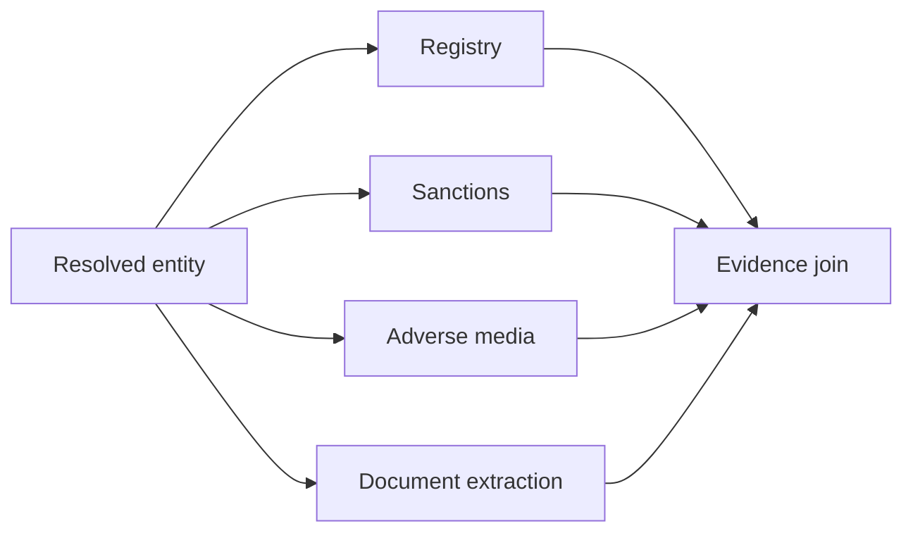
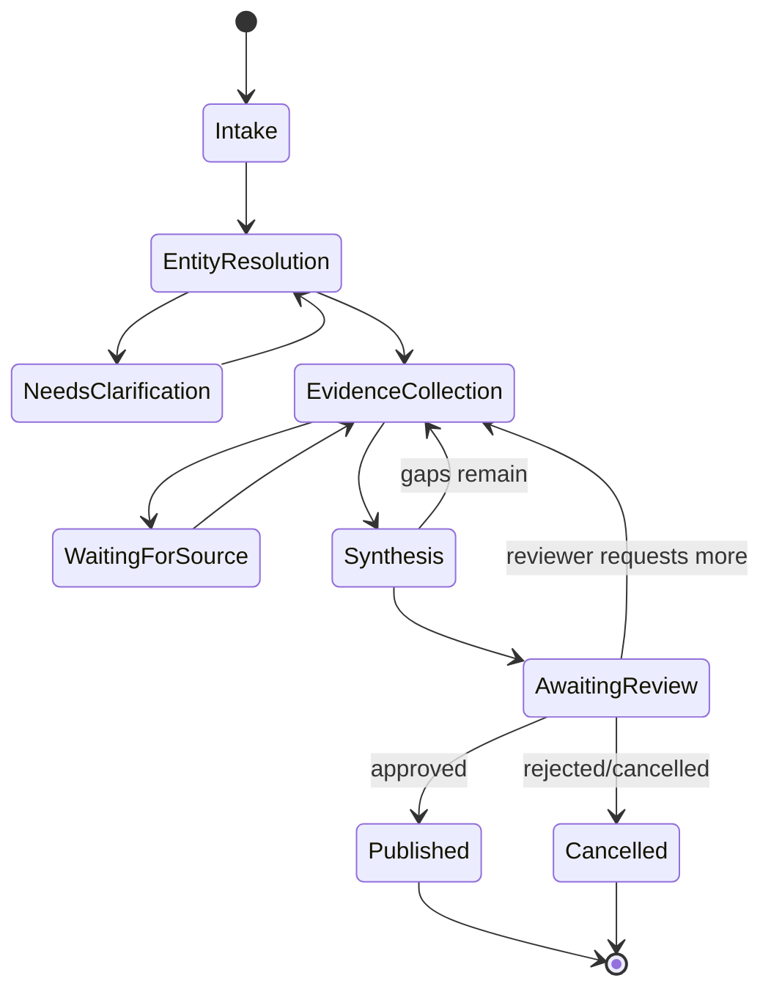

# Orchestration Patterns and State Machines

## What you will design

You will convert Atlas from a single loop into an explicit graph that mixes deterministic stages, model-driven choices, safe parallel work, joins, and controlled revision.

## Orchestration is not intelligence

Orchestration determines:

- what step can run;
- what state it reads;
- what state it may change;
- what may run in parallel;
- how results join;
- when work retries;
- when execution pauses;
- when the system is done.

The model may choose among allowed paths. The orchestrator owns the graph.

## Core patterns

### Prompt chain

One step feeds the next.

Use when:

- the sequence is fixed;
- each stage has a clear contract;
- intermediate validation is valuable.

Atlas example:

```text
extract document → validate entities → normalize → compare with registry
```

### Router

A model or rule selects a path.

Atlas example:

- standard entity;
- ambiguous entity;
- missing documents;
- high-risk jurisdiction.

Use deterministic routing when the condition is known. Use a model when the classification itself is ambiguous and evaluable.

### Parallel fan-out and join

Independent work runs concurrently:



The join must define:

- required branches;
- optional branches;
- deadlines;
- partial results;
- duplicate handling;
- conflict resolution;
- cancellation.

Parallelism reduces wall-clock time only for independent work. It may increase rate-limit pressure and cost.

### Orchestrator-worker

A coordinator decomposes work and workers return bounded outputs.

Useful when subtasks are dynamic but independently verifiable.

Atlas example: research several identified beneficial owners in parallel.

### Planner-executor

A planner creates a task graph; an executor performs tasks.

Use when the plan cannot be enumerated in advance and planning quality can be evaluated. Validate plans before execution. Do not treat a model-generated plan as authority.

### Evaluator-optimizer

One stage produces, another checks against criteria, and revision occurs within a budget.

Atlas example:

- generate a draft packet;
- check evidence coverage and citation support;
- request targeted revision;
- stop after two revisions or escalate.

Prefer deterministic evaluators for hard requirements.

### Supervisor and specialists

A supervisor delegates to specialists with isolated contexts.

Use when specialization, context separation, ownership, or independent scaling provides measurable value. Avoid creating agents only to imitate an organization chart.

## State-machine design

Define Atlas states:



Each transition needs:

- initiator;
- condition;
- state mutation;
- effect;
- audit event;
- retry behavior;
- allowed next states.

This makes invalid transitions rejectable.

## State reducers

When branches run in parallel, define how updates merge.

Bad:

```python
state.update(worker_output)
```

Better:

- evidence is appended by unique source and claim ID;
- status changes are controlled by the orchestrator;
- budgets are summed;
- conflicts are deduplicated;
- completion markers use a set;
- one branch cannot overwrite another branch’s authoritative data.

A merge function is part of correctness.

## Concurrency hazards

### Duplicate work

Two branches resolve the same entity. Use task keys and deduplication.

### Lost updates

Concurrent workers write a shared record. Use optimistic concurrency, event append, or transactional updates.

### Race to terminal state

One branch decides the case is ready while another discovers a critical conflict. Terminal conditions should be evaluated after a defined join or through versioned state.

### User changes during execution

An analyst uploads a corrected document while extraction is running. Decide whether to:

- cancel stale work;
- version artifacts and reconcile;
- queue a new run;
- let both complete and select latest.

### Double input

A user sends a new message while an agent is running. Define queue, interrupt, merge, or reject semantics.

## Dynamic plan representation

If Atlas plans tasks, use a schema:

```python
class PlannedTask(BaseModel):
    task_id: str
    kind: Literal["registry", "sanctions", "document", "media", "synthesis"]
    dependencies: list[str]
    source_or_artifact_id: str | None
    required: bool
    max_attempts: int

class Plan(BaseModel):
    tasks: list[PlannedTask]
    completion_criteria: list[str]
    rationale_summary: str
```

Validate:

- allowed task kinds;
- acyclic dependencies;
- task count;
- source authorization;
- budget;
- required mandatory checks.

## When to use a framework

A graph framework can help with:

- explicit nodes and edges;
- checkpoints;
- streaming;
- interrupts;
- state inspection;
- visualization.

A durable workflow runtime can help with:

- long waits;
- event history;
- timers;
- retries across crashes;
- workflow versioning.

These may be combined. The course architecture keeps orchestration interfaces portable.

## Failure injection: the early finish race

Sanctions and media searches run in parallel. The media branch finishes first. A synthesis node sees enough evidence and creates a packet before the sanctions branch returns a match.

Controls:

- sanctions is marked a required branch;
- join condition requires a fresh terminal result;
- synthesis receives branch status, not only completed data;
- a timeout becomes an explicit unresolved required check;
- publication policy rejects missing sanctions evidence.

## SHIP: build the Atlas graph

Implement nodes for:

- intake;
- entity resolution;
- parallel evidence collection;
- evidence join;
- gap analysis;
- synthesis;
- review preparation.

Required:

- typed state;
- explicit transition guards;
- deterministic merge functions;
- required/optional branch semantics;
- concurrency limit;
- cancellation;
- trace per node and transition.

## RUN: create races

Test:

1. one required branch is slow;
2. one optional branch fails;
3. analyst uploads a new document mid-run;
4. two workers write the same claim;
5. a cancellation arrives during parallel work;
6. evaluator requests repeated revisions;
7. a plan contains a cycle.

## DESIGN: interview drill

**Prompt:** Design an incident-response agent that investigates alerts across logs, tickets, deployments, and cloud systems.

Choose and defend:

- router;
- parallel fan-out;
- planner-executor;
- human approval;
- deterministic join;
- durable workflow.

## Check your understanding

1. When does parallel fan-out reduce latency?
2. What belongs in a join condition?
3. Why must parallel state updates use reducers?
4. When is a supervisor justified?
5. What should validate a model-generated plan?

## Primary references

- [Anthropic: Building Effective AI Agents](https://www.anthropic.com/engineering/building-effective-agents)
- [LangGraph: Workflows and Agents](https://docs.langchain.com/oss/python/langgraph/workflows-agents)
- [LangGraph Overview](https://docs.langchain.com/oss/python/langgraph/overview)
