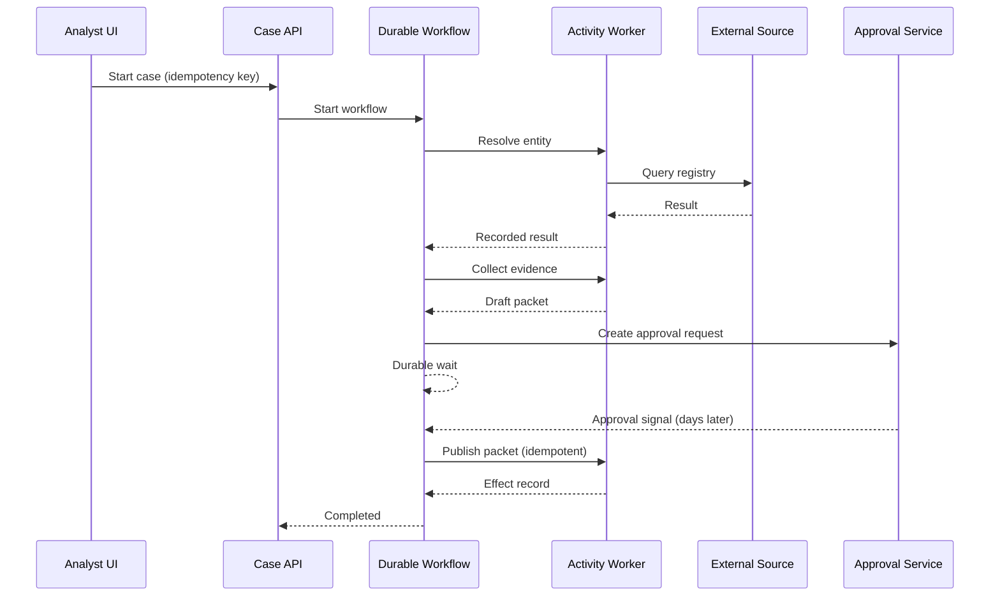

# Durable and Long-Running Agents

## What you will design

You will make Atlas survive worker crashes, API failures, deploys, long waits, duplicate delivery, and human responses that arrive days later.

## Long-running changes the system

A process that runs for seconds can sometimes restart from the beginning. A case that runs for minutes, hours, or weeks cannot safely rely on process memory.

Long-running agents need to preserve:

- progress;
- external effects;
- pending timers;
- pending approvals;
- source waits;
- budgets;
- cancellation;
- version compatibility;
- audit history.

The runtime must distinguish **thinking again** from **doing again**.

## Durable execution

A durable workflow runtime records execution events and can reconstruct workflow state after a worker failure. Conceptually:

```text
workflow code + persisted event history → restored workflow state
```

External, non-deterministic work runs as activities/tasks:

- model calls;
- API calls;
- database effects;
- email;
- document processing.

Workflow code coordinates. Activities interact with the world.

## Determinism and replay

During replay, workflow code must make the same control-flow decisions for the same history. Avoid directly performing non-deterministic work inside replayable workflow code:

- current time;
- random numbers;
- network calls;
- unrecorded model calls;
- arbitrary environment reads.

Use runtime-provided deterministic time/random APIs or activities whose results are recorded.

The model is inherently non-deterministic. Its output should be an activity result recorded in history, not recomputed during replay unless the application intentionally starts a new decision.

## Event history example

```text
CaseStarted
EntityResolutionScheduled
EntityResolutionCompleted
SanctionsCheckScheduled
SanctionsCheckCompleted
MediaSearchScheduled
MediaSearchFailed
RetryTimerStarted
MediaSearchCompleted
DraftPacketCreated
ApprovalRequested
ApprovalReceived
PacketPublished
WorkflowCompleted
```

After a crash, the runtime replays completed events and schedules only work not already recorded as completed.

## Durable does not mean exactly once

An activity may execute more than once due to retries or worker failure. The runtime can ensure the workflow observes one completion, but external effects still require idempotency.

For every activity ask:

- Is it read-only?
- Is a repeat safe?
- Is it idempotent?
- Can effect status be reconciled?
- Does it require compensation?
- Should uncertainty pause for human review?

## Retry and timeout design

Use distinct timeout concepts:

- **schedule-to-start:** queue wait;
- **start-to-close:** one attempt;
- **schedule-to-close:** all attempts;
- **heartbeat:** liveness/progress for long work;
- **workflow deadline:** business deadline.

A 20-minute document extraction activity may heartbeat every 30 seconds with the current page. If a worker dies, another attempt can resume or restart based on artifact checkpoints.

Retries should reflect the error:

```text
retryable transport failure → backoff + jitter
rate limit → honor retry signal and global capacity
bad request → no retry
policy denial → no retry
uncertain write → reconcile
human wait → not a retry; transition and wait
```

## Signals, updates, and timers

Long-running cases receive external events:

- analyst clarification;
- document upload;
- approval;
- cancellation;
- source callback;
- policy change.

The workflow should have durable handlers for these messages.

Example:

```python
@workflow.signal
async def document_received(self, artifact_id: str):
    self.pending_documents.discard(artifact_id)
    self.received_documents.add(artifact_id)
```

Validate signal authorization at the application boundary and record the actor.

Timers support:

- source retry;
- SLA reminder;
- approval expiry;
- case escalation;
- periodic refresh.

Do not keep a server thread sleeping for days.

## Cancellation and compensation

Cancellation should propagate intentionally:

- stop new model decisions;
- cancel safe in-flight work;
- let critical effect reconciliation finish;
- mark artifacts;
- notify the user;
- release reservations;
- record reason and actor.

Compensation is a business action that reverses or mitigates a completed effect:

- retract a draft notification;
- mark a published packet superseded;
- cancel a pending request;
- close a created review task.

Compensation is not database rollback. External systems and humans may have already observed the effect.

## Workflow versioning

Old cases may still be running when code changes.

Strategies:

- version branches inside workflow code;
- route new cases to a new workflow type;
- continue-as-new with migration;
- keep compatible workers until old histories complete;
- explicitly terminate and restart only when business-safe.

Record versions of:

- workflow;
- model;
- prompt;
- tools;
- schema;
- policy;
- retrieval configuration.

A code deploy should not silently reinterpret old event history.

## History growth

Long cases can accumulate large histories. Options:

- continue-as-new with compact state;
- store large artifacts outside history;
- record references rather than full documents;
- limit repetitive trace payloads;
- archive completed workflow data.

Do not place raw PDFs or full model contexts into workflow history.

## Durable architecture for Atlas



## Failure injection: crash after the model call

Atlas calls the model and receives a research plan. The worker crashes before updating local state.

Without durable recording, the plan may be lost or recomputed differently. With a durable activity:

1. the model activity result is committed;
2. workflow replay restores that result;
3. the same plan is not regenerated;
4. unfinished tool tasks continue;
5. budgets remain accurate.

## SHIP: add a durable workflow adapter

Implement a real durable runtime or a faithful event-sourced simulation.

Required behaviors:

- idempotent workflow start;
- model and tool calls as activities;
- retries by error class;
- stable effect keys;
- durable wait for approval;
- external document signal;
- timer and escalation;
- cancellation;
- crash/restart demonstration;
- workflow version recorded.

A strong reference implementation uses Temporal, DBOS, Restate, or an equivalent; the lesson remains concept-first.

## RUN: prove recovery

Demonstrate:

1. kill the worker after three completed steps;
2. restart with no duplicate effect;
3. wait for an approval and resume after process restart;
4. deliver the same approval twice;
5. deploy workflow v2 while v1 cases run;
6. time out an uncertain write and reconcile;
7. cancel during a long extraction.

Record the event history that proves correctness.

## DESIGN: interview drill

**Prompt:** Design an agent that negotiates document collection with a customer over several weeks.

Cover:

- durable workflow;
- external messages;
- timers;
- idempotency;
- long-running state;
- human takeover;
- cancellation;
- workflow versioning;
- data retention.

## Check your understanding

1. Why should a model call be an activity result?
2. What can be replayed safely?
3. Why can an activity still execute more than once?
4. What is the difference between retry and durable wait?
5. Why is compensation not a database rollback?

## Primary references

- [Temporal: Understanding Temporal](https://docs.temporal.io/evaluate/understanding-temporal)
- [Temporal Workflows](https://docs.temporal.io/workflows)
- [Temporal Activities](https://docs.temporal.io/activities)
- [Temporal Event History](https://docs.temporal.io/encyclopedia/event-history/event-history-java)
- [OpenAI Agents SDK: Durable Integrations](https://openai.github.io/openai-agents-python/running_agents/)
