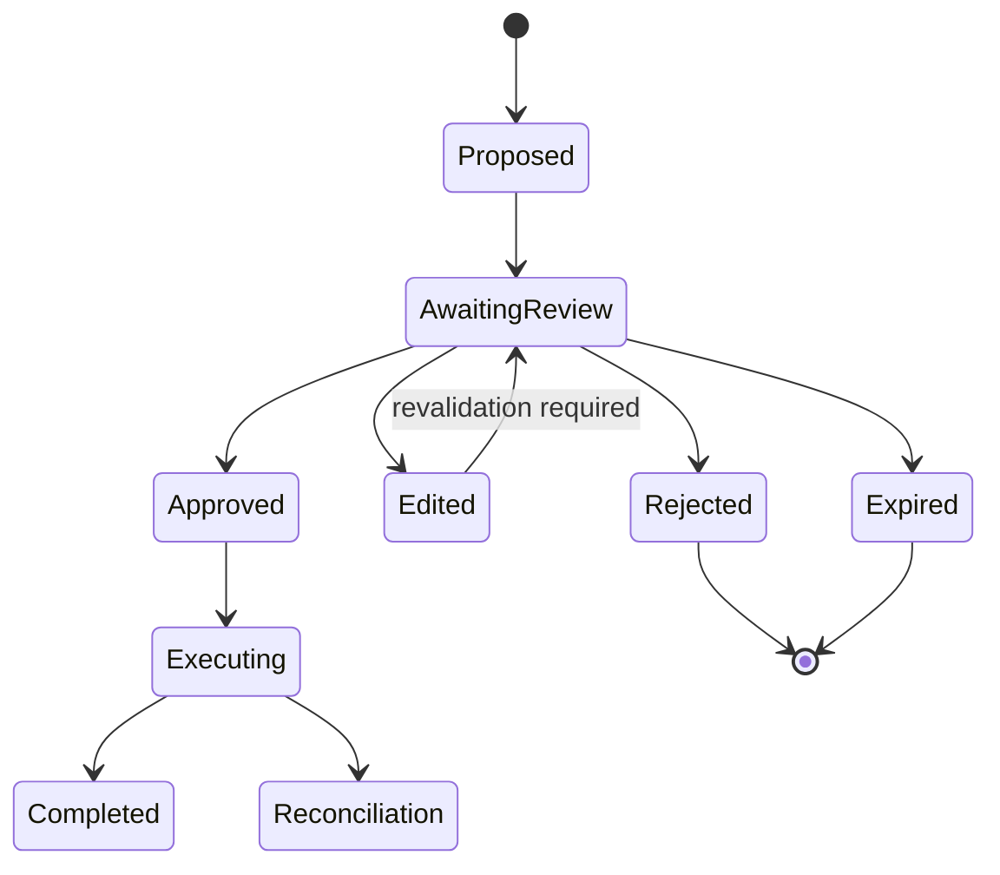

# Human-in-the-Loop and Bounded Authority

## What you will design

You will add durable human review to Atlas and design authority based on risk, reversibility, evidence, and separation of duties.

## Human review is a state, not a sentence

A system prompt that says “ask for approval before important actions” is not an approval system.

A production approval requires:

- a persisted proposed action;
- the exact inputs and expected effect;
- supporting evidence;
- the reason approval is required;
- the requesting workflow and user;
- an authenticated reviewer;
- approve, edit, reject, and escalate outcomes;
- expiry and reminder policy;
- an audit record;
- a durable resume path;
- protection against duplicate or stale decisions.

The workflow must be unable to cross the boundary without a valid decision.

## Where humans add value

Human involvement is useful for different reasons:

### Authority

The organization requires a human to own the decision.

### Ambiguity

Evidence is conflicting or incomplete.

### Exception handling

The case does not match known policy.

### Quality calibration

Human judgments create labels and reveal failure modes.

### Relationship or empathy

The action requires context that is difficult or inappropriate to automate.

### Recovery

A tool or workflow is stuck and needs takeover.

Do not use “human in the loop” as one generic checkpoint. Design the specific role.

## Authority matrix

Classify actions across impact and reversibility.

| Action | Impact | Reversible | Default |
|---|---|---:|---|
| Search a public source | Low | N/A | Automatic |
| Save a private draft | Low | Yes | Automatic |
| Send an internal clarification | Medium | Usually | Conditional |
| Contact an external counterparty | Medium | Partially | Review by policy |
| Publish an official packet | High | Versioned, not invisible | Human approval |
| Make onboarding decision | Very high | Often material | Human-owned |
| Share data outside approved boundary | Prohibited | No | Deny |

The model may produce recommendations for prohibited autonomous actions; the system must still deny execution.

## Approval payload

The reviewer should see an **intent**, not a vague chat transcript.

```python
class ApprovalRequest(BaseModel):
    approval_id: str
    tenant_id: str
    case_id: str
    workflow_id: str
    action_type: str
    proposed_arguments: dict
    rendered_preview: str
    evidence_refs: list[str]
    policy_rule_ids: list[str]
    risk_tier: int
    requested_by: str
    created_at: datetime
    expires_at: datetime
    idempotency_key: str
    current_state_version: int
```

Include a human-readable diff when editing or publishing an existing artifact.

## Decision types

### Approve

Execute the exact proposed action if it is still valid.

### Edit

The reviewer changes permitted fields. The application validates the edited action and records who changed what.

### Reject

Do not execute. Return structured feedback to the workflow.

### Request more information

Resume research or wait for another artifact.

### Escalate

Move to a higher-authority reviewer or specialist.

### Take over

Terminate or suspend autonomous execution and assign the case to a human.

## Stale approval protection

An approval may arrive after the underlying case changes.

Before execution, compare:

- state version;
- policy version;
- artifact version;
- recipient or target;
- expiry;
- reviewer authority.

If the proposal is stale, require re-review. Do not apply an old approval to a new action because the action type is similar.

## Separation of duties

For high-consequence workflows, the same identity should not be able to:

1. create the proposal;
2. approve it;
3. execute it;
4. alter the audit log.

The exact separation depends on policy, but the architecture should support distinct actors and service roles.

## Approval UX

A review interface should answer:

- What is Atlas proposing?
- Why?
- What evidence supports it?
- What remains uncertain?
- What changed since the previous version?
- What will happen after approval?
- Can the effect be undone?
- How long is the approval valid?
- What are the alternatives?

Poor UX turns human review into rubber stamping. Track review duration and edit/reject rates, but do not optimize only for faster approval.

## Confidence is not authority

A high model confidence score should not bypass a mandated review. Confidence may help prioritize cases, but it is not a legal or organizational permission.

Likewise, low confidence is not the only reason to involve a human. A fully deterministic high-confidence action may still require human authority.

## Interrupt and resume

A durable pattern:



Persist the workflow state before presenting the approval. When a decision arrives, resume the specific workflow instance using the approval ID and state version.

## Escalation policy

Define escalation triggers:

- approval approaching SLA;
- evidence conflict;
- source outage;
- policy ambiguity;
- repeated reviewer rejection;
- high-risk jurisdiction;
- tool effect uncertainty;
- suspected prompt injection;
- user dispute;
- cost or time budget exhausted.

Escalation is a designed terminal or transitional state, not a failure to “be autonomous.”

## Emergency controls

Production agents need:

- per-case cancel;
- per-tool disable;
- tenant kill switch;
- global read-only mode;
- model/provider disable;
- side-effect freeze;
- ability to drain or pause queues;
- audit-preserving manual takeover.

Test these controls before an incident.

## Failure injection: approved action changed underneath

An analyst approves a document request to Contact A. Before execution, another user corrects the case and Contact B becomes authoritative.

Controls:

1. approval contains state version and target;
2. execution revalidates current state;
3. mismatch marks the approval stale;
4. Atlas creates a new proposal;
5. reviewer sees the diff.

## SHIP: build the approval service

Implement:

- approval table or service;
- durable wait;
- approval payload;
- authenticated reviewer;
- approve/edit/reject/request-more/escalate;
- state-version validation;
- expiry;
- reminder;
- audit;
- separation-of-duties hook;
- idempotent decision handling.

Build a simple review UI or API.

## RUN: attack the approval path

Test:

1. approval submitted twice;
2. approval from an unauthorized reviewer;
3. expired approval;
4. case changed after approval;
5. edited action violates policy;
6. workflow cancelled while approval is pending;
7. malicious source text appears in the preview;
8. kill switch activates before execution.

## DESIGN: interview drill

**Prompt:** Design an agent that drafts and sends enterprise emails on behalf of employees.

Explain:

- which emails are automatic;
- which need confirmation;
- preview and diff;
- delegated identity;
- stale approvals;
- duplicate send prevention;
- recipient allowlists;
- take-over and revocation.

## Check your understanding

1. Why is an approval a persisted workflow state?
2. What makes an approval stale?
3. Why is confidence not authority?
4. What is the purpose of separation of duties?
5. Name three emergency controls.

## Primary references

- [LangChain: Human-in-the-Loop](https://docs.langchain.com/oss/python/langchain/human-in-the-loop)
- [LangGraph: Interrupts](https://docs.langchain.com/oss/python/langgraph/interrupts)
- [OpenAI Agents SDK: Human in the Loop](https://openai.github.io/openai-agents-python/)
