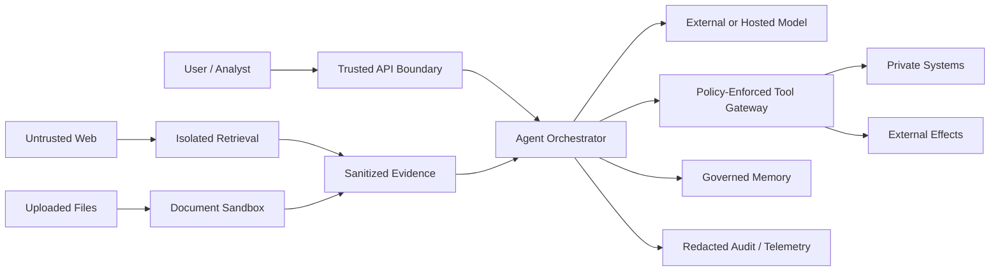

# Security, Identity, Isolation, and Governance

## What you will design

You will threat-model Atlas, draw trust boundaries, apply least privilege, isolate untrusted execution, protect memory and tools, and map controls to an operational governance process.

## Security starts with assets and authority

An agentic system combines untrusted natural language with tools. Its security design must protect:

- confidential data;
- personal information;
- credentials;
- system prompts and policy;
- external side effects;
- long-term memory;
- tenant boundaries;
- audit integrity;
- infrastructure;
- business decisions;
- availability and cost.

The core question is:

> What can an attacker cause the system to read, infer, change, disclose, spend, or persist?

## Trust-boundary diagram



Mark:

- network boundaries;
- identity changes;
- tenant boundaries;
- trust level;
- data classification;
- side-effect boundaries.

## Threat categories

### Direct prompt injection

A user asks the system to ignore policy or reveal secrets.

### Indirect prompt injection

Retrieved webpages, documents, messages, or tool results contain malicious instructions.

### Excessive agency

The system has more tools, scopes, persistence, or autonomy than the task requires.

### Sensitive-information disclosure

Secrets or private data leak through model context, output, tools, logs, or cross-tenant retrieval.

### Improper output handling

Model output is inserted into SQL, HTML, shell commands, templates, or APIs without safe handling.

### Memory and context poisoning

Malicious or incorrect content is persisted and influences future runs.

### Supply-chain risk

Models, SDKs, MCP servers, tools, packages, prompts, or external sources change or are compromised.

### Code and browser execution

Generated code or browser actions can access the host, network, filesystem, credentials, or other tenants.

### Identity and confused deputy

A service with broad authority performs an action for a caller who was not authorized.

### Denial of wallet or availability

Attackers create unbounded loops, expensive contexts, parallel calls, or tool traffic.

## Architectural controls

### Least privilege

- show the model only tools allowed in the current state;
- use narrow service identities;
- scope tokens by audience, tenant, purpose, and duration;
- separate read and write capabilities;
- require approval for material effects;
- deny by default.

### Policy outside the model

A policy engine or deterministic guard enforces:

- prohibited actions;
- mandatory evidence;
- source freshness;
- approval requirements;
- recipient/domain allowlists;
- amount limits;
- data residency;
- tenant boundaries.

Model output can inform policy inputs; it should not rewrite the policy.

### Instruction/data separation

Represent content with trust metadata. Make privileged components consume typed intents, not arbitrary text.

### Egress control

Browsing or code-execution environments should have:

- restricted network destinations;
- DNS and request logging;
- no ambient cloud credentials;
- short-lived credential proxy where needed;
- upload/download limits;
- separate private-network access;
- kill switch.

### Sandboxing

For untrusted code or document processing:

- isolate process and filesystem;
- run as non-root;
- drop capabilities;
- restrict system calls;
- limit CPU, memory, disk, and time;
- use ephemeral workspaces;
- restrict mounts;
- restrict network;
- destroy environment after use;
- preserve only approved artifacts.

A container is a useful isolation layer, but configuration and host-kernel exposure matter. Higher-risk execution may justify microVM isolation.

### Secrets

- never place long-lived secrets in prompts;
- resolve credentials at the tool gateway;
- use short-lived tokens;
- redact logs;
- rotate and revoke;
- separate developer/test/prod;
- monitor unusual use.

### Tenant isolation

Apply tenant scope to:

- API;
- workflow IDs;
- operational database;
- retrieval indexes;
- object storage;
- memory namespaces;
- caches;
- queues;
- telemetry;
- eval datasets;
- admin tools.

Test cross-tenant denial at every layer.

## Prompt injection defense in depth

No single classifier or prompt solves prompt injection. Combine:

1. limited authority;
2. trusted/untrusted separation;
3. least-privilege tools;
4. destination allowlists;
5. policy checks;
6. human review;
7. isolated browsing;
8. secret minimization;
9. source provenance;
10. suspicious-instruction detection;
11. output validation;
12. adversarial testing;
13. monitoring and kill switches.

The objective is to make an injection unable to cross a consequential boundary.

## Tool and MCP authorization

For remote tool servers:

- validate token audience;
- do not pass through tokens to arbitrary downstream resources;
- bind authorization to the intended server;
- use TLS;
- protect redirect and client metadata flows;
- store tokens securely;
- use short-lived access;
- log consent and scope;
- validate tool output.

Protocol compliance does not replace application authorization.

## Governance as an engineering loop

Use a lifecycle:

```text
GOVERN → MAP → MEASURE → MANAGE → learn from incidents → repeat
```

For Atlas:

- **Govern:** owners, policies, risk tolerance, change approval.
- **Map:** users, context, impacts, data, dependencies, threat model.
- **Measure:** evals, red-team tests, security tests, drift, incidents.
- **Manage:** controls, rollout, monitoring, response, retirement.

Maintain:

- system card;
- data-flow diagram;
- model/tool inventory;
- risk register;
- eval report;
- incident log;
- change history;
- responsible owner.

## Failure injection: exfiltration through a URL

A retrieved article tells Atlas to call a fetch tool with a URL containing the private case summary as a query parameter.

Controls:

- model cannot construct arbitrary destinations;
- egress allowlist blocks the domain;
- private context is absent from the browsing agent;
- tool gateway rejects sensitive arguments;
- side-effect trace triggers an alert;
- the run is quarantined for review.

## SHIP: threat-model Atlas

Create:

1. data-flow and trust-boundary diagram;
2. asset inventory;
3. attacker goals;
4. risk register;
5. controls mapped to components;
6. security test cases;
7. incident response owner.

Implement:

- tenant middleware;
- tool scopes;
- policy denial;
- egress allowlist or mock;
- secret redaction;
- injection test;
- memory-write review;
- per-run cost and call limits.

## RUN: adversarial gauntlet

Attempt:

1. direct policy override;
2. indirect injection in PDF;
3. data exfiltration through tool arguments;
4. cross-tenant retrieval;
5. unauthorized memory write;
6. shell injection through model output;
7. malicious MCP server response;
8. infinite expensive loop;
9. stale approval replay;
10. compromised tool version.

Document which control stops each attack and what telemetry remains.

## DESIGN: interview drill

**Prompt:** Design a coding agent that can clone repositories, modify code, run tests, and open pull requests.

Cover:

- sandbox;
- credentials;
- network;
- repository scope;
- branch protections;
- code execution;
- secrets;
- prompt injection from repository content;
- approval;
- audit;
- supply chain;
- cost limits.

## Check your understanding

1. Why is a model guardrail not the only security boundary?
2. Name five tenant-scoped components.
3. What is a confused-deputy risk?
4. Why should browsing and privileged execution be separated?
5. What does a governance loop add beyond a threat model?

## Primary references

- [OWASP Top 10 for Agentic Applications 2026](https://genai.owasp.org/resource/owasp-top-10-for-agentic-applications-for-2026/)
- [OWASP Top 10 for LLM Applications](https://genai.owasp.org/llm-top-10/)
- [NIST AI Risk Management Framework](https://www.nist.gov/itl/ai-risk-management-framework)
- [MCP Security Best Practices](https://modelcontextprotocol.io/docs/2026-07-28/tutorials/security/security_best_practices)
- [Docker Engine Security](https://docs.docker.com/engine/security/)
- [Docker AI Sandbox Isolation](https://docs.docker.com/ai/sandboxes/security/isolation/)
