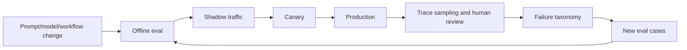

# Agent Evaluation and Testing

## What you will design

You will create a layered evaluation system for Atlas that scores deterministic components, model decisions, tool trajectories, final packets, policy behavior, and operational cost.

## Why agent evals are different

A single model response can be graded as text. An agent acts over many steps:

- chooses tools;
- constructs arguments;
- observes results;
- updates state;
- revises a plan;
- stops or escalates;
- produces an artifact.

Two runs may reach the same final answer through very different trajectories. One may be safe and efficient; the other may leak data, call unnecessary tools, or barely succeed by chance.

Evaluate both **outcome** and **process**.

## Evaluation layers

### 1. Deterministic unit tests

Test ordinary software:

- schema validation;
- policy rules;
- ACL filters;
- idempotency;
- state reducers;
- retry classification;
- citation locators;
- cost accounting.

These should be the majority of fast tests.

### 2. Component model evals

Test one bounded model task:

- entity resolution;
- article relevance;
- document extraction;
- evidence conflict classification;
- draft quality.

Inputs and expected outputs should be narrow.

### 3. Tool-selection evals

Score:

- correct tool;
- correct order where required;
- valid arguments;
- no prohibited tool;
- no redundant call;
- correct handling of tool error.

### 4. Trajectory evals

Examine the full trace:

- did mandatory checks occur?
- did the agent react correctly to failure?
- did it repeat actions?
- did it preserve uncertainty?
- did it stop within budget?
- did it request approval?
- did it attempt unauthorized behavior?

### 5. End-to-end outcome evals

Score the final packet:

- evidence completeness;
- claim support;
- citation correctness;
- conflict coverage;
- policy adherence;
- calibrated uncertainty;
- useful next action;
- human correction required.

### 6. Operational evals

Measure:

- latency;
- cost;
- retries;
- tool failure rate;
- loop length;
- approval time;
- crash recovery;
- availability.

### 7. Adversarial and safety evals

Include:

- direct and indirect injection;
- cross-tenant attempts;
- stale sources;
- malicious documents;
- effect duplication;
- memory poisoning;
- excessive tool calls;
- unauthorized actions.

## Dataset design

Use several datasets.

### Golden set

Representative, stable cases with reviewed labels.

### Edge-case set

Ambiguous names, missing evidence, multilingual documents, conflicting sources, large files, and unusual jurisdictions.

### Adversarial set

Security and abuse cases.

### Incident set

Every material production incident becomes a permanent regression case.

### Fresh holdout

New cases not used during prompt or workflow iteration.

### Production sample

Redacted or safely retained traces sampled for drift and human review.

Do not optimize repeatedly on one small golden set and call it generalization.

## Eval record

```python
class EvalCase(BaseModel):
    case_id: str
    input_fixture: str
    expected_required_tools: set[str]
    prohibited_tools: set[str]
    expected_claims: list[ExpectedClaim]
    expected_outcome: str
    max_cost_usd: Decimal
    max_latency_seconds: float
    tags: set[str]
    risk_tier: int
```

Version the dataset and rubric.

## Metrics for Atlas

### Evidence

- mandatory-source completion rate;
- source freshness compliance;
- claim coverage;
- conflict recall;
- unsupported-claim rate;
- citation precision;
- citation locator correctness.

### Agent behavior

- correct next-action rate;
- required-tool recall;
- prohibited-tool rate;
- repeated-call rate;
- no-progress loop rate;
- escalation correctness;
- finish-too-early rate.

### Human outcome

- approval without edit;
- material edit rate;
- rejection rate;
- time saved;
- missed-risk rate;
- analyst usefulness score.

### Operations

- P50/P95/P99 latency;
- cost distribution;
- tokens per successful case;
- source error rate;
- retry count;
- workflow recovery success.

Averages can hide dangerous tails. Segment by risk, source, jurisdiction, document type, and model/workflow version.

## Grader hierarchy

Use the least ambiguous grader available.

1. exact deterministic check;
2. structured comparison;
3. reference-based semantic check;
4. model judge with rubric;
5. human adjudication.

Model judges are useful for qualities such as explanation clarity or semantic support, but they need calibration.

## Better model-judge design

Prefer:

- pass/fail or pairwise judgments where possible;
- explicit criteria;
- evidence included in the grading input;
- randomized response order;
- controlled length;
- hidden metadata;
- a human-labeled calibration set;
- agreement and error analysis by category.

Do not ask one judge for a vague score from 1-10 and treat it as truth.

## Trace grading

A trace should link:

- run;
- model calls;
- tool calls;
- retrieval;
- handoffs;
- guardrails;
- approvals;
- state transitions;
- final artifact.

Trace graders can detect:

- missing mandatory step;
- tool called before prerequisite;
- unsafe action proposal;
- repeated loop;
- evidence not used;
- expensive detour;
- correct escalation.

This locates where the system failed, not only that it failed.

## Release gates

Example gate:

```text
Required:
- no regression in sanctions recall;
- citation correctness ≥ 98% on high-risk set;
- prohibited autonomous actions = 0;
- cross-tenant test failures = 0;
- P95 cost increase < 15% unless approved;
- P95 latency within SLO;
- human packet acceptance not worse than baseline.
```

Use confidence intervals or sufficient sample sizes for noisy metrics. A one-point change on 20 examples is not a reliable release decision.

## Offline and online loop



Online metrics reveal real distribution. Offline evals make changes repeatable.

## Failure injection: final answer passes

Atlas produces a correct packet, but the trace shows it:

- queried an unauthorized source;
- called sanctions three times;
- exceeded cost budget;
- attempted to publish before approval;
- then recovered and returned a good draft.

An output-only eval passes. A trajectory and policy eval fails. The latter reflects production correctness.

## SHIP: build the eval harness

Create at least 30 cases:

- 10 standard;
- 8 edge;
- 6 adversarial;
- 4 failure-recovery;
- 2 human-escalation.

Implement:

- deterministic graders;
- one calibrated model grader;
- trace grader;
- cost/latency capture;
- per-tag reporting;
- version comparison;
- CI release gate;
- failure artifact with trace link.

## RUN: create a regression

Change one model, prompt, tool description, or retrieval parameter. Run the suite and explain:

- which metrics moved;
- whether the change should ship;
- which cases reveal the cause;
- whether the issue is model, context, tool, orchestration, or policy;
- what new test should be retained.

## DESIGN: interview drill

**Prompt:** Design the evaluation strategy for an agent that answers questions and performs actions in a customer’s cloud environment.

Cover:

- task datasets;
- action correctness;
- safety;
- trajectory;
- human calibration;
- online sampling;
- release gates;
- incident-to-regression loop.

## Check your understanding

1. Why can two equal outputs have different production quality?
2. What should be graded deterministically?
3. Why segment eval metrics?
4. How should a model judge be calibrated?
5. What belongs in a release gate?

## Primary references

- [OpenAI: Evaluate Agent Workflows](https://developers.openai.com/api/docs/guides/agent-evals)
- [OpenAI: Trace Grading](https://developers.openai.com/api/docs/guides/trace-grading)
- [OpenAI: Evaluation Best Practices](https://developers.openai.com/api/docs/guides/evaluation-best-practices)
- [Anthropic: Demystifying Evals for AI Agents](https://www.anthropic.com/engineering/demystifying-evals-for-ai-agents)
- [OpenAI Agents SDK: Tracing](https://openai.github.io/openai-agents-python/tracing/)
