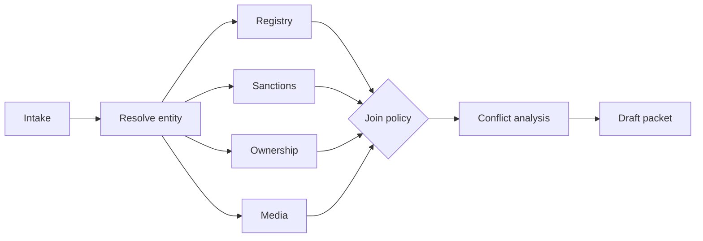

# Latency, Cost, Throughput, and Scale

## What you will design

You will convert Atlas from a correct single-user prototype into a service that meets latency, throughput, quota, and unit-economics constraints under bursty enterprise demand.

## Begin with a workload model

“Scale the agent” is not a requirement. Establish:

- requests or cases per day;
- peak arrival rate;
- concurrent active and waiting workflows;
- interactive versus background paths;
- input and output size distribution;
- tool fan-out;
- model calls per case;
- case-duration distribution;
- tenant concentration;
- regional and data-residency constraints;
- latency and cost objectives;
- retry and failure assumptions.

### Atlas course assumptions

These are fictional numbers for the design exercise:

```text
20,000 new cases/day
10× burst over daily average
500 simultaneously executing cases
50,000 additional cases waiting on humans or documents
P95 interactive action < 2 seconds
P95 standard draft < 10 minutes
P95 high-risk draft < 30 minutes
median variable cost < $0.80 per standard case
hard autonomous budget = $4.00 per case
```

A waiting workflow should not hold a worker, model slot, or database connection.

## Draw the latency path

Break end-to-end latency into components:

```text
queue wait
+ orchestration overhead
+ context assembly
+ model inference
+ tool/network time
+ document processing
+ join waits
+ artifact generation
+ human wait, when applicable
```

Human wait belongs in business lead time, but not in a model-service latency SLO. Show both.

## Critical path versus total work

Parallelism reduces latency only for independent work.

Atlas can safely parallelize:

- registry lookup;
- sanctions check;
- ownership lookup;
- adverse-media search;
- document extraction for separate files.

It cannot finalize synthesis before mandatory source checks return or are explicitly waived.



Define the join policy:

- which results are mandatory;
- which can time out and degrade;
- which require retry;
- which force escalation;
- how late results update an artifact.

## Optimize in the right order

1. Remove unnecessary work.
2. Make independent work concurrent.
3. reduce context and output.
4. choose the appropriate model per task.
5. cache safe, reusable work.
6. improve infrastructure and locality.
7. relax an objective only with product agreement.

Do not jump to a smaller model while the system is sending the entire case history to every call.

## Reduce model work

### Use deterministic code where possible

Do not use a model for:

- exact policy thresholds;
- schema validation;
- sorting and filtering;
- permissions;
- date arithmetic;
- deduplication by stable identifier;
- retry classification;
- budget accounting.

### Bound the task

Prefer several narrow, testable calls over one ambiguous prompt when it improves control. But avoid decomposing so far that overhead and inconsistency dominate.

### Reduce output tokens

Request a typed decision rather than an essay:

```json
{
  "next_action": "SEARCH_MEDIA",
  "reason_code": "MISSING_ADVERSE_MEDIA",
  "queries": ["Example Holdings bribery investigation"],
  "stop": false
}
```

Generate polished prose only when the user needs it.

### Stream only where it improves experience

Streaming reduces perceived latency for interactive text, not underlying completion time. It is less useful for background workflows or structured decisions that must validate before use.

## Context economics

Every repeated token increases latency and cost.

Track context by purpose:

- stable policy prefix;
- task instructions;
- current state summary;
- retrieved evidence;
- recent observations;
- output schema.

Use:

- stable prompt prefixes;
- retrieval instead of full-corpus stuffing;
- compact state summaries;
- evidence IDs and targeted excerpts;
- incremental updates;
- per-step context budgets;
- provider-supported prompt caching where safe.

Do not cache a cross-tenant prompt prefix that accidentally contains tenant data.

## Cache taxonomy

### Deterministic application cache

Examples:

- registry response by entity ID and source version;
- normalized document text by content hash;
- embedding by model version and chunk hash;
- policy document parse by policy version.

### Semantic/result cache

Riskier. A similar question may not have the same correct answer. Include user, tenant, authorization, freshness, policy, model, and source dimensions. Prefer caching stable sub-results over final recommendations.

### Prompt cache

Provider-side reuse of a repeated prefix can reduce repeated processing. Keep the reusable prefix stable and place variable content later. Treat cache behavior as an optimization, not a correctness mechanism.

### Negative cache

A temporary cache of known missing or failed results can protect a dependency from repeated calls, but must have short, error-aware expiry.

## Freshness and invalidation

Every cache entry needs:

- key;
- scope;
- source version or timestamp;
- TTL or invalidation event;
- authorization context;
- model/prompt/parser version where relevant;
- stale-use policy.

A sanctions result may require much stricter freshness than a normalized historical filing.

## Model routing

Use task- and risk-aware routing, not a permanent “cheap model first” assumption.

Possible dimensions:

- task type;
- risk tier;
- context size;
- language;
- tool requirement;
- latency objective;
- uncertainty or conflict;
- model capability availability;
- budget remaining.

Example:

```text
simple entity normalization → small structured-output model
standard source relevance → economical classifier
conflicting ownership evidence → stronger reasoning model
high-risk final synthesis → validated high-capability path + human review
```

### Route using measured quality

Build an eval matrix by task and segment:

| Task | Model A | Model B | Model C |
|---|---:|---:|---:|
| Entity resolution accuracy | 98.1% | 96.8% | 92.0% |
| Citation-supported synthesis | 94.2% | 91.0% | 80.4% |
| Median latency | 2.8s | 1.1s | 0.5s |
| Median cost | High | Medium | Low |

Choose the least expensive path that still meets the quality and risk requirement. Re-evaluate as models and traffic change.

## Budget-aware execution

Maintain a per-run budget ledger:

```python
class RunBudget(BaseModel):
    max_cost_usd: Decimal
    spent_usd: Decimal = Decimal("0")
    reserved_usd: Decimal = Decimal("0")
    max_model_calls: int
    model_calls: int = 0
    deadline_at: datetime
    max_steps: int
    steps: int = 0
```

Before expensive fan-out, reserve estimated budget. On completion, settle actual cost.

Policy examples:

- at 60%: summarize state and avoid low-value exploration;
- at 80%: route noncritical work to lower-cost path;
- at 95%: stop optional work;
- at 100%: escalate with partial evidence, never silently exceed.

A hard budget must not cause the agent to hide incomplete mandatory checks. It should return an explicit incomplete state.

## Queues and admission control

Separate queues by workload and service objective:

- interactive control requests;
- standard research;
- high-risk research;
- document extraction;
- bulk refresh;
- low-priority re-evaluation.

Use admission control when demand exceeds safe capacity:

- per-tenant quotas;
- global concurrency limits;
- provider-specific token/request limits;
- weighted fair scheduling;
- priority and deadline;
- maximum queue age;
- load shedding for optional work.

Fairness matters. One large tenant should not starve every other tenant.

## Backpressure

Backpressure tells upstream systems to slow down rather than accepting infinite work.

Signals include:

- queue depth;
- queue age;
- worker saturation;
- model quota utilization;
- database latency;
- dependency error rate;
- token throughput.

Responses include:

- reject with retry guidance;
- defer noncritical fan-out;
- reduce concurrency;
- switch to batch processing;
- degrade optional enrichment;
- pause bulk jobs;
- require explicit user continuation.

## Retry storms

A dependency failure can multiply load:

```text
1,000 cases × 4 tools × 5 retries = 20,000 attempted calls
```

Use:

- exponential backoff;
- jitter;
- retry budgets;
- centralized rate-limit coordination;
- circuit breakers;
- concurrency limits;
- `Retry-After` handling;
- dead-letter or human escalation;
- idempotency and reconciliation for writes.

Retry only errors likely to improve with time.

## Bulkheads and circuit breakers

A bulkhead isolates resources so one dependency or tenant cannot exhaust the whole system.

Examples:

- separate worker pools for document extraction and interactive actions;
- per-tool concurrency pools;
- per-tenant ceilings;
- regional partitions;
- separate model-provider budgets.

A circuit breaker stops calls to a failing dependency, then probes recovery. Its fallback must be explicit:

- cached result within freshness policy;
- alternate source;
- alternate provider;
- partial packet marked incomplete;
- human escalation.

## Capacity estimate

Assume 20,000 cases/day and four model decisions per standard case:

```text
80,000 model calls/day average
≈ 0.93 calls/second average
10× peak ≈ 9.3 calls/second
```

That call rate alone is incomplete. Token throughput may be the binding limit.

Suppose an average call has 8,000 input and 400 output tokens:

```text
peak input throughput ≈ 74,400 tokens/second
peak output throughput ≈ 3,720 tokens/second
```

Then add retries, high-risk cases, eval shadow traffic, and headroom. Capacity planning should use distributions, not only averages.

## Cost model

Estimate per case:

```text
model input
+ model output
+ embeddings/reranking
+ external data/tool fees
+ document processing
+ workflow/compute
+ storage and telemetry
+ eval sampling
+ human review
```

Unit economics should include failed and abandoned runs.

Example variables:

```text
C_case = Σ(model_tokens × rate)
       + Σ(tool_calls × rate)
       + compute_time × rate
       + storage
       + observability
       + expected_human_minutes × loaded_rate
```

The cheapest model path can be more expensive overall if it causes retries, poor tool choices, or more human correction.

## Load-test design

A useful agent load test includes realistic distributions:

- small and large documents;
- standard and high-risk cases;
- cache hits and misses;
- tool latency and errors;
- model rate limits;
- approval waits;
- resumed workflows;
- tenant skew;
- burst arrivals;
- poisoned or malformed content;
- retry and recovery.

Measure:

- valid completion rate;
- queue age;
- P50/P95/P99 by stage;
- token and cost distributions;
- dependency saturation;
- retries;
- loop length;
- worker utilization;
- state-store hot partitions;
- fairness by tenant.

Do not run production side effects in a load test. Use stubs, sandboxes, or test tenants with enforced policy.

## Graceful degradation order

Define the order before an incident:

1. remove optional enrichment;
2. lower retrieval breadth within quality bounds;
3. use cached stable sub-results within freshness policy;
4. route low-risk tasks to validated fallback models;
5. defer background work;
6. require human continuation for incomplete mandatory work;
7. reject new work rather than corrupt existing work.

Never degrade tenant isolation, approval requirements, required sanctions checks, or auditability.

## Failure injection: retry amplification

The media provider returns rate limits for five minutes. Every Atlas activity retries immediately. Queue depth increases, database writes spike, and model calls continue proposing more searches.

Fix the system with:

- one provider-level circuit breaker;
- coordinated rate-limit state;
- exponential backoff and jitter;
- a retry budget;
- no-progress suppression;
- a maximum dependency wait;
- explicit partial-result or escalation state;
- low-priority queue pause.

## SHIP: performance and cost controls

Implement or specify:

1. A workload and capacity model.
2. A critical-path latency budget.
3. Safe parallel source checks with a join policy.
4. Per-run step, time, token, and dollar budgets.
5. Model routing backed by task evals.
6. At least two cache types with scope and invalidation.
7. Queue isolation, quotas, and weighted fairness.
8. Retry budgets, jitter, circuit breaker, and bulkheads.
9. A load test with burst, tenant skew, tool failure, and resumed workflows.
10. A unit-economics report by case segment.

## RUN: break the capacity plan

Run three experiments:

- 10× arrival burst;
- one dependency at 50% errors;
- one tenant sending 70% of traffic.

For each, report:

- user impact;
- first saturated resource;
- whether SLOs held;
- whether fairness held;
- cost amplification;
- triggered degradation;
- one architecture change.

## DESIGN: interview drill

**Prompt:** Design a customer-support agent that handles 10 million conversations per month and can execute account actions.

Cover:

- workload assumptions;
- interactive and background paths;
- critical path;
- context/token economics;
- task-based model routing;
- queues, quotas, and fairness;
- retries and backpressure;
- safe caching;
- cost budgets;
- load tests and graceful degradation.

## Check your understanding

1. Why is concurrency not equal to request rate for long-running workflows?
2. What work can Atlas safely parallelize?
3. Why can a smaller model increase total system cost?
4. What belongs in a cache key for tenant-scoped evidence?
5. How does a retry storm form?
6. Which controls must never be relaxed during graceful degradation?

## Primary references

- [OpenAI: Latency Optimization](https://developers.openai.com/api/docs/guides/latency-optimization)
- [OpenAI: Prompt Caching](https://developers.openai.com/api/docs/guides/prompt-caching)
- [OpenAI: Batch API](https://developers.openai.com/api/docs/guides/batch)
- [Anthropic: Prompt Caching](https://docs.anthropic.com/en/docs/build-with-claude/prompt-caching)
- [Google SRE Book: Handling Overload](https://sre.google/sre-book/handling-overload/)
