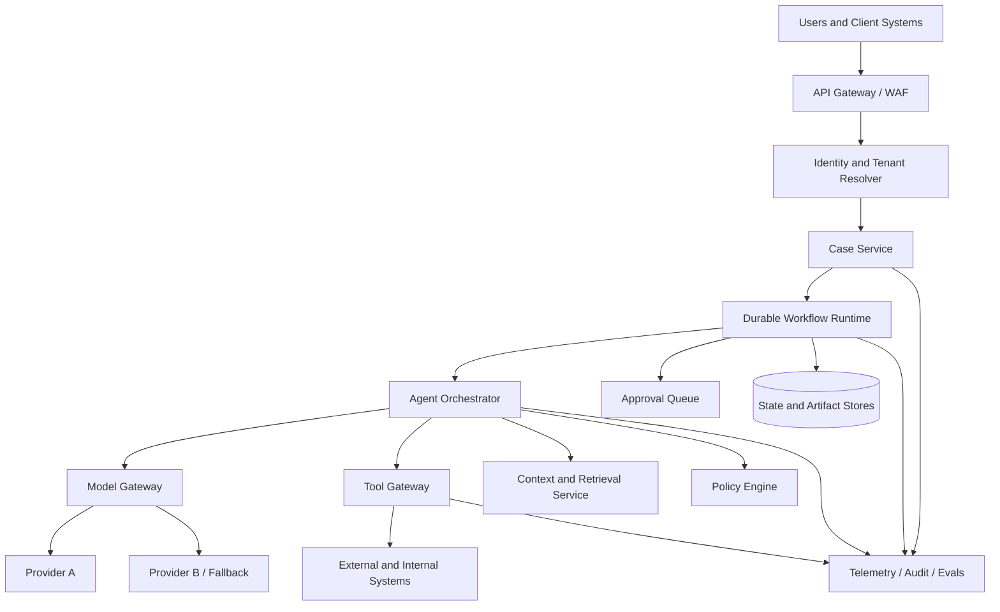

# Deployment, Change Management, and Enterprise Readiness

## What you will design

You will turn Atlas into an operable enterprise service with versioned releases, controlled rollouts, rollback, data governance, tenant isolation, regional deployment, disaster recovery, and clear ownership.

## Production readiness is a system property

A strong demo can answer the happy-path question. An enterprise system must also answer:

- Who owns it at 2 AM?
- Which versions produced this decision?
- Can one tenant’s data reach another tenant?
- Where is data stored and for how long?
- What happens when a model or tool provider changes?
- Can a risky capability be disabled without redeploying everything?
- Can an in-flight case survive a workflow upgrade?
- Can operators reconcile uncertain effects?
- Can the organization prove who approved a final action?

Treat deployment, governance, and operations as part of architecture, not paperwork after the architecture.

## Reference production topology



Key separations:

- user identity from model identity;
- orchestration from tool execution;
- policy from natural-language prompts;
- durable state from worker memory;
- model-provider access from application code;
- telemetry from governed content artifacts;
- online serving from offline eval and replay.

## The release bundle

A production behavior is more than a model name. Version the complete bundle:

```yaml
release_id: atlas-2026.08.14-rc3
workflow_version: 18
prompt_bundle_version: 42
model_policy_version: 9
retrieval_config_version: 12
tool_contract_versions:
  sanctions_search: 4
  registry_lookup: 7
policy_bundle_version: 31
eval_dataset_version: 26
artifact_schema_version: 6
memory_schema_version: 3
```

Every run must record the effective bundle. A rollback is impossible if the team cannot reconstruct what changed.

## Environments and promotion

Use isolated environments with separate identities and data:

- local development;
- ephemeral pull-request environment;
- integration;
- evaluation/staging;
- production;
- security or adversarial test environment where needed.

Do not copy raw production data into lower environments by default. Use synthetic, de-identified, or explicitly governed fixtures.

Promotion should move immutable artifacts and configuration references, not rebuild unknown behavior in each environment.

## CI/CD pipeline

```mermaid
flowchart LR
    C[Code/config change] --> U[Unit and contract tests]
    U --> E[Offline eval suite]
    E --> S[Security and policy tests]
    S --> R[Workflow replay compatibility]
    R --> P[Package immutable release]
    P --> H[Shadow traffic]
    H --> K[Canary]
    K --> G[Progressive rollout]
    G --> M[Post-release monitoring]
    M -->|regression| B[Rollback / capability disable]
```



### Required gates

- deterministic tests;
- tool contract tests;
- schema compatibility;
- policy and tenant-isolation tests;
- prompt-injection/adversarial tests;
- offline quality evals;
- cost and latency budgets;
- durable workflow replay/versioning tests;
- dependency sandbox tests;
- migration tests;
- audit and telemetry completeness.

A release should fail closed on safety-critical regression.

## Shadow, canary, and progressive rollout

### Shadow

Run the new version against captured or mirrored inputs without production effects. Compare decisions and artifacts to the active version.

Controls:

- no production writes;
- no outbound communication;
- scoped credentials;
- separate trace marking;
- governed data access;
- cost cap.

### Canary

Send a small, representative subset of eligible live traffic to the new version. Segment by tenant, risk, language, source, and input size.

### Progressive rollout

Increase traffic only when:

- quality gates hold;
- safety violations remain zero;
- latency and cost remain in budget;
- no incident signal appears;
- support and operations are ready.

A 5% random canary can miss rare high-risk cases. Include deliberate risk-stratified coverage.

## Feature and authority flags

Useful controls include:

- tool enabled/disabled;
- autonomous step count;
- required approval level;
- model route;
- retrieval source;
- memory write enabled;
- tenant rollout eligibility;
- maximum spend;
- outbound effect enabled;
- high-risk mode.

Evaluate flags in a trusted control plane and record their effective values in the run. A model should not be able to toggle its own authority.

## Rollback semantics

There are at least four rollback targets:

1. code or workflow;
2. model/prompt/configuration;
3. tool or connector version;
4. data/schema migration.

Rollback must define what happens to in-flight workflows:

- finish on original version;
- migrate at an explicit safe point;
- suspend and require operator action;
- start a new linked run;
- compensate or supersede affected artifacts.

Do not silently replay old steps under new model behavior.

## Durable workflow evolution

Long-lived workflows may outlast several deployments. Preserve deterministic replay by:

- patch/version markers;
- backward-compatible state changes;
- new workflow type for breaking changes;
- safe-point migration;
- tests against historical event histories;
- retention of required worker versions until old runs drain.

A harmless-looking refactor can break replay if it changes recorded control flow.

## Model and provider change management

A provider may:

- release a new model snapshot;
- retire a model;
- change rate limits;
- change tool-call behavior;
- change safety behavior;
- experience regional failure;
- alter pricing.

Use a model gateway to centralize:

- approved model aliases;
- task/risk routing;
- credentials;
- quotas;
- retries and timeouts;
- structured-output enforcement;
- content policy;
- telemetry;
- fallback;
- emergency disable.

Pin versions when the provider supports it. When it does not, monitor behavior drift and maintain stronger regression gates.

## Fallback is a product decision

A fallback model is not automatically equivalent. Define per task:

- whether fallback is allowed;
- validated quality;
- maximum context;
- tool and schema support;
- data residency;
- safety behavior;
- cost/latency difference;
- whether human review becomes mandatory.

Example:

```text
entity normalization → fallback allowed
standard article classification → fallback allowed after eval gate
high-risk ownership synthesis → fallback only with forced analyst review
final publication decision → never autonomous; human remains required
```

## Tenant isolation

Enforce tenant scope at every layer:

- identity token;
- API authorization;
- workflow state;
- cache key;
- queue metadata;
- object storage path and encryption key;
- vector/retrieval filter;
- tool credential;
- memory namespace;
- telemetry access;
- support tooling;
- backup and restore.

Defense in depth matters because a model may generate an incorrect identifier. The data layer must still prevent cross-tenant access.

### Noisy-neighbor controls

Use:

- quotas;
- concurrency limits;
- weighted queues;
- storage limits;
- per-tenant budgets;
- circuit-breaker isolation;
- hot-partition detection.

## Enterprise identity and access

Support:

- SSO and federation;
- role- and attribute-based access;
- service identities;
- just-in-time privileged access;
- short-lived credentials;
- tool-specific scopes;
- approval separation of duties;
- revocation;
- immutable audit.

Propagate the user and tenant identity to tools when appropriate. Do not replace a user’s narrow authority with one broad shared service account.

## Secrets and connectors

- store secrets in a managed secret system;
- use workload identity where possible;
- rotate automatically;
- scope by environment, tenant, and tool;
- never place secrets in prompts, model-visible memory, or logs;
- record credential identity, not credential value;
- support connector disable and revocation;
- test expired and revoked credentials.

## Data lifecycle

Create a data inventory:

| Data | Purpose | Classification | Residency | Retention | Deletion path |
|---|---|---|---|---|---|
| Case input | Due diligence | Confidential | Tenant region | Policy-defined | Case deletion workflow |
| Retrieved document | Evidence | Confidential/untrusted | Tenant region | Source/policy-defined | Artifact purge |
| Prompt artifact | Debug/audit | Potentially sensitive | Controlled region | Shorter by default | Trace purge |
| Long-term memory | User/org preference | Governed | Tenant region | Explicit policy | Memory deletion API |
| Eval fixture | Regression | De-identified where possible | Eval environment | Versioned | Dataset governance |

Account for:

- deletion from primary and derived stores;
- embeddings and indexes;
- caches;
- backups;
- traces;
- model-provider retention terms;
- legal hold;
- export and access requests.

## Audit trail

For material actions, record:

- actor and tenant;
- run and case;
- proposed action;
- policy evaluation;
- approver and decision;
- tool and arguments hash;
- effect/result identifier;
- artifact before/after version;
- release bundle;
- timestamp;
- reason or ticket.

Audit records must be tamper-resistant and access-controlled. An editable application log is not sufficient for high-consequence actions.

## Regional design and residency

Decide whether the system is:

- single region;
- active/passive;
- active/active;
- region-pinned per tenant;
- globally routed with regional data planes.

Keep tenant data, state, artifacts, indexes, telemetry, and model/tool calls inside allowed boundaries. A globally hosted control plane should not pull sensitive case content across regions.

## Backup, disaster recovery, and continuity

Define RPO and RTO by component:

- workflow histories;
- state database;
- artifact store;
- policy/configuration;
- audit records;
- retrieval indexes;
- eval datasets.

Test:

- restore into isolated environment;
- regional failover;
- resumption of waiting workflows;
- deduplication after recovery;
- external effect reconciliation;
- credential and DNS dependencies;
- model-provider regional outage.

A backup that has never been restored is an assumption.

## Operational ownership

For every component name:

- owning team;
- on-call rotation;
- escalation contact;
- SLO;
- runbook;
- deployment process;
- capacity owner;
- data owner;
- security owner;
- vendor owner;
- end-of-life plan.

### Minimum runbooks

- model-provider outage;
- tool/connector outage;
- prompt-injection incident;
- cross-tenant access suspicion;
- cost runaway;
- stuck workflow;
- duplicate external effect;
- expired credential;
- rollback;
- region failover;
- data deletion request.

## Enterprise readiness evidence

A buyer or review board will often ask for evidence, not adjectives.

Prepare:

- architecture and data-flow diagrams;
- threat model;
- data inventory;
- access-control matrix;
- model/tool/provider inventory;
- evaluation report;
- incident and vulnerability process;
- retention/deletion controls;
- business continuity test;
- change-management policy;
- audit samples;
- shared-responsibility model.

Avoid saying “the model does not retain data” unless contract, configuration, and architecture support that statement.

## Failure injection: silent model drift

A provider updates the behavior behind an alias. Atlas still passes availability SLOs, but now skips a mandatory ownership clarification in 4% of complex cases.

The controls that catch it:

- immutable release metadata records the provider/model identity;
- continuous sampled evals detect the segment regression;
- high-risk source-completion gate fires;
- model gateway routes the affected task to a validated fallback;
- in-flight high-risk cases require additional review;
- new fixture enters the regression set;
- provider alias is no longer treated as an unversioned dependency.

## SHIP: create the production release

Produce:

1. Production architecture and trust-boundary diagram.
2. Versioned release-bundle schema.
3. CI gates for deterministic, eval, security, cost, latency, and replay tests.
4. Shadow, canary, and progressive rollout plan.
5. Feature/authority flags and emergency disable path.
6. In-flight workflow upgrade and rollback policy.
7. Model/provider fallback matrix.
8. Tenant-isolation checklist.
9. Data inventory and deletion flow.
10. SSO/RBAC/service-identity design.
11. RPO/RTO table and recovery test.
12. Ownership and runbook matrix.

## RUN: execute a release game day

Simulate a release that causes one of:

- citation regression;
- cost increase;
- workflow replay failure;
- tool schema mismatch;
- tenant-specific authorization failure;
- provider-region outage.

Demonstrate:

- detection;
- traffic containment;
- safe handling of in-flight runs;
- rollback or capability disable;
- effect reconciliation;
- user communication trigger;
- regression fixture and release-gate improvement.

## DESIGN: interview drill

**Prompt:** Design the production deployment and enterprise controls for an agent that prepares and submits insurance claims.

Cover:

- release bundle;
- eval and security gates;
- shadow/canary/rollback;
- long-running workflow versioning;
- tenant and regional isolation;
- identity and approval;
- data retention/deletion;
- provider fallback;
- disaster recovery;
- ownership and audit.

## Check your understanding

1. Why is a model name insufficient to identify production behavior?
2. What makes shadow execution safe?
3. How should in-flight workflows behave during rollback?
4. Why must tenant scope exist in caches and telemetry, not only the API?
5. What should be validated before using a fallback model?
6. Which evidence demonstrates enterprise readiness better than “secure by design”?

## Primary references

- [NIST AI Risk Management Framework](https://www.nist.gov/itl/ai-risk-management-framework)
- [NIST AI RMF: Generative AI Profile](https://www.nist.gov/publications/artificial-intelligence-risk-management-framework-generative-artificial-intelligence)
- [OpenAI: Production Best Practices](https://developers.openai.com/api/docs/guides/production-best-practices)
- [Temporal: Safe Deployments](https://docs.temporal.io/production-deployment/worker-deployments/worker-versioning)
- [OWASP Top 10 for Agentic Applications 2026](https://genai.owasp.org/resource/owasp-top-10-for-agentic-applications-for-2026/)
