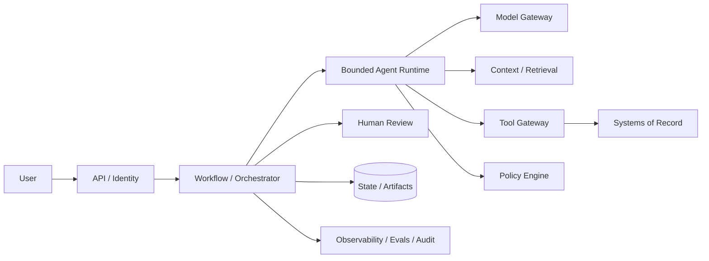

# The 45-Minute Agentic System-Design Interview

## What you will design

You will turn an ambiguous agent prompt into a defensible production design under interview time pressure. The goal is not to mention every concept in this course. It is to identify the constraints that matter, make coherent choices, and go deep where failure is expensive.

## What interviewers are evaluating

A strong answer demonstrates that you can:

- clarify the product and user outcome;
- decide whether autonomy is justified;
- define authority and human control;
- translate requirements into architecture;
- separate probabilistic decisions from deterministic enforcement;
- design tools, context, state, and durable execution;
- handle security, identity, and multi-tenancy;
- evaluate quality and safety;
- operate at scale under latency and cost constraints;
- reason about failure and recovery;
- communicate tradeoffs and sequence.

The diagram is evidence of reasoning. It is not the objective by itself.

## The 45-minute structure

| Time | Focus | Deliverable |
|---:|---|---|
| 0-5 min | Clarify | User, outcome, scale, authority, risk, latency |
| 5-8 min | Scope | Functional/nonfunctional requirements and non-goals |
| 8-13 min | High-level design | End-to-end architecture and trust boundaries |
| 13-25 min | Core flow | State, tools, context, orchestration, human control |
| 25-34 min | Deep dive | One or two differentiating constraints |
| 34-40 min | Quality and operations | Evals, observability, latency, cost, rollout |
| 40-44 min | Failures and tradeoffs | Failure scenarios, alternatives, evolution |
| 44-45 min | Close | Re-state design and open questions |

You can adjust, but do not spend 20 minutes gathering requirements and leave no design.

## Use RUNTIME as a mental checklist

### R: Requirements and risk

Ask only questions that change the architecture:

- Who is the user, and what artifact or action do they need?
- Is the system advising, drafting, executing, or deciding?
- What is the worst credible failure?
- What scale and latency matter?
- Are cases interactive, long-running, or both?
- What data, residency, and tenant constraints exist?
- Which quality metric matters more than “sounds good”?

State reasonable assumptions when the interviewer does not specify.

### U: User journey and authority

Narrate the happy path and identify control points:

```text
submit → clarify → research → synthesize → review → execute/publish → correct/audit
```

Classify actions as read-only, reversible, external side effect, or material decision. Define what the model may propose and what deterministic policy or human approval must authorize.

### N: Nodes and topology

Choose the simplest topology that satisfies the constraints:

- deterministic workflow;
- router;
- bounded agent loop;
- parallel fan-out/fan-in;
- supervisor and specialists;
- durable workflow;
- asynchronous jobs and callbacks.

Do not introduce multiple agents merely to make the diagram look advanced.

### T: Tools, context, and data

Cover:

- typed tool contracts;
- identity and tenant scope;
- side-effect and idempotency semantics;
- retrieval and ACL enforcement;
- provenance and freshness;
- context budget and compaction;
- structured outputs;
- model/tool error behavior.

### I: Integrity, identity, isolation, and governance

Draw trust boundaries around:

- untrusted user and document content;
- model output;
- tool gateway;
- tenant data;
- secrets;
- human approvals;
- audit and telemetry;
- sandboxed execution.

### M: Memory and durable execution

Explain which information lives in:

- run state;
- thread/session state;
- long-term memory;
- artifact/evidence store;
- workflow event history.

If a process can wait or retry, explain recovery, idempotency, timers, signals, cancellation, and versioning.

### E: Evals, economics, observability, and evolution

Define:

- offline datasets;
- deterministic and model graders;
- trajectory and safety evals;
- online metrics and human feedback;
- release gates;
- trace model;
- SLOs;
- cost and step budgets;
- canary and rollback.

## The first diagram

Use a coarse diagram that establishes responsibility.



Then annotate:

- trust boundaries;
- tenant scope;
- sync versus async;
- read versus write paths;
- durable state;
- external effects;
- version metadata.

## Requirement-to-architecture translation

Interviewers listen for causal reasoning.

Weak:

> I will use a vector database and LangGraph.

Strong:

> Because the case may wait for external documents for 30 days, I will store business state in a durable workflow and resume through authenticated signals. A vector index may support evidence retrieval, but it does not replace workflow state or provenance.

More examples:

| Requirement | Consequence |
|---|---|
| Final action is regulated | Human approval enforced outside model |
| Tool may create charges | Idempotency key, reconciliation, approval |
| Documents contain instructions | Treat as untrusted data; isolate instruction channel |
| Data is tenant-scoped | Scope identity, storage, retrieval, cache, tools, traces |
| Model behavior changes | Version bundle, eval gate, canary, rollback |
| P95 under 5 seconds | Bounded path, parallel reads, small output, cached stable prefix |
| Case waits days | Durable workflow, timers, signals, no held worker |

## A worked Atlas answer

### 1. Clarify

> I’ll assume the user is a bank risk analyst. The system prepares a cited due-diligence packet; it does not approve or reject a counterparty. Standard cases should draft within ten minutes, high-risk cases within thirty. Cases may wait for documents for up to thirty days. We need tenant isolation, auditability, and no autonomous publication.

### 2. Functional requirements

- intake an entity and case policy;
- resolve identity;
- search mandatory sources;
- extract uploaded evidence;
- detect conflicts and gaps;
- produce claim-level citations;
- request missing evidence;
- pause for authenticated review;
- publish an approved, immutable packet;
- support correction and cancellation.

### 3. Nonfunctional requirements

- durable multi-day execution;
- no duplicate external effects;
- tenant and regional isolation;
- source freshness;
- traceability;
- quality/safety release gates;
- latency and cost budgets;
- safe model/provider change.

### 4. High-level design

Use the diagram above. Explain that the durable workflow owns business state and waits; the bounded agent decides among allowed research actions; the tool gateway performs authorization and effects; the context service assembles authorized, cited evidence; the policy engine constrains authority; and the approval service is a deterministic gate.

### 5. Core flow

```text
CaseCreated
→ ResolveEntity
→ ParallelMandatoryChecks
→ JoinOrEscalate
→ AnalyzeConflicts
→ AgentGapLoop(max 4 steps)
→ DraftPacket
→ ValidateClaimsAndCitations
→ AwaitHumanApproval
→ PublishVersionedArtifact
```

### 6. Tool contracts

Each tool has typed input/output, required scope, side-effect class, timeout, retry policy, idempotency behavior, and audit metadata. Read-only checks can retry. An uncertain write must reconcile against the system of record before retrying.

### 7. Context and provenance

The context builder retrieves only tenant- and case-authorized evidence, ranks by task, enforces freshness, and preserves source IDs and exact locators. The model returns structured claims that reference evidence IDs. A deterministic validator rejects unsupported claims.

### 8. State and durability

Run state includes the plan, evidence ledger, budgets, pending tools, and approval state. Large documents live in artifact storage. Workflow event history restores control flow after crashes. A waiting approval consumes no worker. Model calls and external APIs are recorded activities; effects are idempotent.

### 9. Security

Untrusted content cannot issue system instructions. Tools execute with least privilege. Tenant scope is enforced in storage and retrieval. High-risk tools require policy and approval. Code/file processing occurs in a sandbox without ambient credentials. Prompts and traces are redacted and access-controlled.

### 10. Evals and operations

Offline suites cover component quality, required-tool recall, trajectory, citations, prompt injection, tenant isolation, crash recovery, and cost. Every run emits linked model/tool/workflow spans and release metadata. Shadow and canary releases must pass quality, safety, latency, and cost gates.

### 11. Scale

Safe source checks run in parallel. Queues isolate interactive, research, and extraction work. Per-tenant quotas and budgets prevent noisy neighbors. Model routing is task/risk-aware and validated by evals. Retry budgets and circuit breakers prevent amplification.

### 12. Close

> The design deliberately keeps final authority outside the model. I would first ship a deterministic workflow with one bounded research loop, then increase autonomy only where evals show a measurable benefit.

## Choosing the deep dive

Pick the constraint that makes the prompt agentic and production-specific.

Good deep dives:

- long-running durability and effect semantics;
- prompt injection and tool authorization;
- retrieval provenance and claim validation;
- human approval and bounded authority;
- multi-tenant isolation;
- trajectory evals and rollout;
- latency/cost under tool fan-out.

Avoid deep-diving into generic database partitioning unless scale makes it the differentiator.

## Communicating tradeoffs

Use this pattern:

```text
I choose X because requirement Y dominates.
The cost is Z.
I mitigate that with M.
I would switch to alternative A when condition C becomes true.
```

Example:

> I will begin with one orchestrator plus deterministic workers because shared state and policy are simpler to reason about. The tradeoff is less independent scaling and team ownership. I would introduce service or agent boundaries only when a capability needs separate security, lifecycle, or ownership.

## Failure injection: the framework-first answer

A candidate draws five named agents, a vector database, and a queue, but never defines who may issue a refund, how a duplicate write is prevented, what state survives a crash, or how a model change is evaluated.

Recover the answer by returning to RUNTIME:

1. state the user outcome and worst credible failure;
2. classify authority and external effects;
3. simplify the topology;
4. add trusted tool, identity, and state boundaries;
5. define eval, trace, budget, and rollout evidence.

The goal is not to preserve the original diagram. It is to preserve a coherent design.

## Common weak answers

### Framework-first

Listing an SDK does not explain control flow, authority, state, or failure semantics.

### “The prompt will ensure it”

Prompts cannot enforce authorization, idempotency, tenant isolation, or durable approval.

### Multi-agent theater

Naming “researcher,” “critic,” and “writer” does not justify separate agents.

### Memory as one database

Conversation state, durable state, evidence, and long-term memory have different lifecycles and correctness requirements.

### Only output quality

A correct final response can hide unsafe tools, waste, repeated effects, or policy violations.

### No failure path

Production design must address timeouts, partial results, malformed outputs, rate limits, crashes, duplicate delivery, cancellation, and provider changes.

### Unbounded scale claims

“Use Kubernetes” does not answer token quotas, queueing, context cost, tool fan-out, or tenant fairness.

### Human in the loop as a button

Approval needs authenticated identity, policy, durable state, expiry, edit/reject paths, and audit.

## Self-scoring rubric

Score each dimension from 0-4.

| Dimension | 0 | 2 | 4 |
|---|---|---|---|
| Requirements | Assumes prompt | Basic use case | Architecture-changing constraints explicit |
| Authority/risk | Missing | Mentions approval | Actions classified; enforcement and escalation clear |
| Architecture | Components only | Coherent happy path | Responsibilities, trust boundaries, sync/async clear |
| Tools/context | Vague | Basic tool/RAG design | Contracts, provenance, ACLs, side effects, freshness |
| State/runtime | Process memory | Persistent state | Durable replay, retries, idempotency, waits, versioning |
| Security | Prompt guardrail | Some controls | Identity, isolation, injection, sandbox, audit, secrets |
| Evals | “Test accuracy” | Offline examples | Layered, trajectory/safety, online loop, release gates |
| Operations | Logs and scaling | Metrics/queues | SLOs, traces, cost, backpressure, incident/rollback |
| Tradeoffs | None | One alternative | Choices tied to constraints and evolution triggers |
| Communication | Disorganized | Understandable | Sequenced, concise, checks alignment, closes clearly |

Target 32/40 or higher before considering the answer interview-ready. A score is useful only when accompanied by evidence and one improvement for each weak dimension.

## Mock interview protocol

### Round 1: open-book, 60 minutes

Use the RUNTIME canvas and complete the full answer.

### Round 2: 45 minutes, notes limited to one page

Record yourself. Draw the architecture live.

### Round 3: adversarial follow-up

Have a reviewer inject three constraints after the initial design:

- traffic increases 20×;
- the agent can now issue refunds;
- customers require regional residency;
- the model provider is unavailable;
- one source contains prompt injection;
- workflows can wait 90 days.

Update the architecture rather than restarting the answer.

### Round 4: 30-minute compressed version

Practice prioritization. Keep the same core design, but state what you would defer.

## SHIP: create your interview packet

Produce:

1. One-page RUNTIME canvas.
2. One high-level architecture diagram.
3. One sequence/state diagram.
4. Tool contract example.
5. State model.
6. Threat model excerpt.
7. Eval and SLO table.
8. Three failure/recovery scenarios.
9. Cost and scale estimate.
10. Two explicit tradeoffs.

## RUN: record and review

Deliver a 45-minute Atlas answer. Review the recording at 1.5× speed and mark:

- unanswered clarifying questions;
- components introduced without purpose;
- requirements not translated into architecture;
- long monologues;
- missing authority or failure semantics;
- premature low-level detail;
- unmeasured claims;
- repeated points;
- weak closing summary.

Self-score using the rubric and repeat only the lowest two dimensions.

## DESIGN: practice prompts

1. Design an agent that investigates cloud-security alerts and can remediate low-risk findings.
2. Design a coding agent that modifies a million-line enterprise repository.
3. Design an agent that processes insurance claims with human approval.
4. Design a customer-support agent that can refund orders.
5. Design an internal research agent across enterprise documents with ACLs.
6. Design a long-running procurement agent that coordinates vendors and approvals.

The practice pack provides full constraints and evaluation signals for these and additional scenarios.

## Check your understanding

1. Which five clarifying questions most often change an agent architecture?
2. Why should the first diagram remain coarse?
3. What makes a strong tradeoff statement?
4. When is multi-agent decomposition justified?
5. Which deep dive would distinguish Atlas from a generic web service?
6. What belongs in the final 60-second close?

## Primary references

- [OpenAI: Applied AI Engineer role competencies](https://openai.com/careers/applied-ai-engineer-enterprise-san-francisco/)
- [Anthropic: Building Effective AI Agents](https://www.anthropic.com/engineering/building-effective-agents)
- [OpenAI Agents SDK](https://openai.github.io/openai-agents-python/)
- [NIST AI Risk Management Framework](https://www.nist.gov/itl/ai-risk-management-framework)
