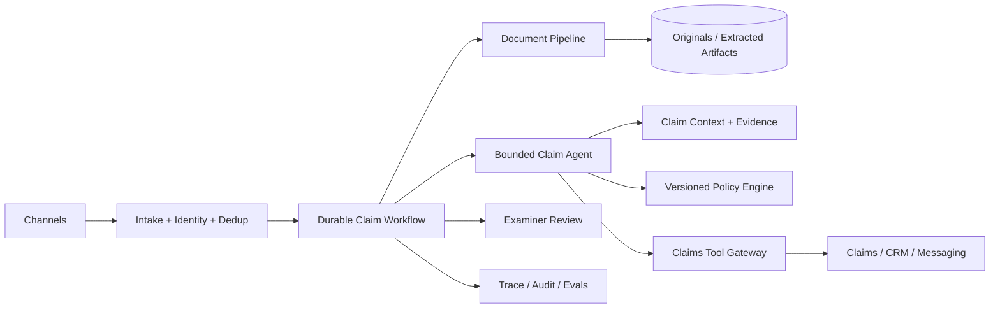

# Insurance Claims Intake and Adjudication Support Agent

## Candidate prompt

Design an agent that receives insurance claims, gathers and extracts documents, checks policy coverage, identifies missing information and inconsistencies, and prepares an adjudication packet for a human claims examiner.

## Starting assumptions

Fictional assumptions:

- 100,000 claims arrive per month through web, mobile, email, and partner APIs.
- Claims include forms, photos, invoices, repair estimates, police reports, and medical documents.
- A claim may stay open for 90 days.
- The system may request information and create tasks, but a human owns denial, fraud referral, and material payment decisions.
- Multiple insurance products and jurisdictions have different policy rules and retention requirements.

## What to clarify

- Which claim/product type is the initial scope?
- What actions may be automatic?
- What is the authoritative policy version?
- Which documents are mandatory and how are they verified?
- What are fraud and high-risk escalation rules?
- How quickly should a claimant receive acknowledgment and status?
- Are payments or reserves in scope?
- What data residency and sensitive-data rules apply?

## Staged constraint reveals

### Reveal 1: Document quality

Many documents are scans, duplicates, altered images, or in several languages. One invoice conflicts with the policyholder’s statement.

Expected update:

- artifact pipeline with malware scan, classification, OCR/extraction, content hash, deduplication, language, and quality score;
- preserve originals and extraction provenance;
- confidence by field;
- conflict ledger rather than silent resolution;
- manual review threshold;
- targeted re-extraction or alternate parser;
- field-level evals.

### Reveal 2: Policy change

Coverage rules change while old claims remain open. The organization must explain which policy version was applied at every decision.

Expected update:

- effective-dated versioned policy store;
- deterministic policy engine for contractual rules;
- bind every assessment to policy version and claim event time;
- no mutable prompt-only policy;
- workflow/version migration decision;
- re-evaluation process and audit.

### Reveal 3: Side effects

The agent requests the same medical document twice after a callback is duplicated. The duplicate messages alarm the claimant.

Expected update:

- idempotent request identity based on claim, document type, and request cycle;
- callback/event deduplication;
- request status in workflow state;
- suppress repeats inside policy window;
- message artifact/version and channel audit;
- uncertain-send reconciliation where provider supports it.

### Reveal 4: Fairness and quality

The model escalates more claims from one language group. Overall accuracy remains unchanged.

Expected update:

- segmented eval and monitoring by language and relevant legally permitted attributes/proxies;
- examine document-quality and translation confounders;
- human adjudication and root-cause analysis;
- calibrated task-specific models/parsers;
- policy and data review;
- no unsupported causal claim from correlation alone;
- release gate for material segment regression.

## Strong answer signals

### Product boundary

The system prepares evidence and recommendations. It may automate acknowledgments and low-risk administrative tasks, but material claim denial, fraud referral, and payment decisions remain controlled by policy and authorized humans.

### Architecture

### State

- claim and claimant identity;
- policy version/effective dates;
- document inventory and request status;
- extracted fields with confidence/provenance;
- conflicts and unresolved items;
- fraud/risk flags;
- deadlines and statutory timers;
- human decisions;
- artifacts and effect IDs;
- release versions.

### Document and context controls

- uploaded content is untrusted;
- separate original, extracted text, normalized facts, and model interpretations;
- field-level source pointers;
- ACL and purpose restrictions for medical data;
- context minimized by task;
- sensitive trace capture restricted;
- derived indexes deleted with the claim when required.

### Evals

- document classification and field extraction;
- mandatory-document completion;
- policy-rule correctness;
- contradiction recall;
- unsupported recommendation rate;
- request duplication;
- human correction;
- segment quality;
- privacy and injection attacks;
- long-running recovery and deadline adherence.

## Failure follow-ups

1. A claimant uploads a password-protected archive.
2. The OCR service returns a different total from the invoice image.
3. An examiner edits the packet after approving it.
4. A jurisdiction requires deletion while a legal hold exists.
5. The messaging provider times out after sending a request.
6. A claim is transferred between business units with different permissions.

## Scoring emphasis

| Dimension | Weight |
|---|---:|
| Human authority and policy versioning | 20% |
| Document/provenance design | 20% |
| Durable workflow and effects | 20% |
| Privacy/security/governance | 15% |
| Evals and segmented quality | 15% |
| Scale and user experience | 10% |

## Model outline

Use a durable claim workflow and document artifact pipeline. Deterministic policy code owns coverage rules; the model extracts, compares, summarizes, and proposes next steps through typed tools. Every field and claim links to original evidence. Missing-document requests and callbacks are idempotent. Human decisions bind to immutable packet versions. Tenant, product, jurisdiction, and purpose scope propagate through storage and tools. Offline and online evals cover extraction, policy, conflict detection, trajectory, segment quality, privacy, and recovery.
