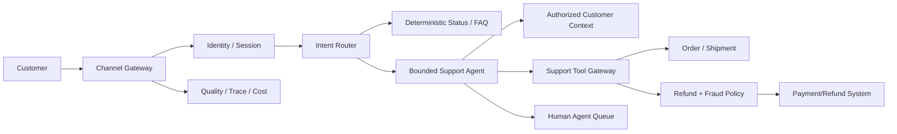

# Customer Support Agent with Refund Authority

## Candidate prompt

Design a customer-support agent for an e-commerce company. It should answer questions, troubleshoot orders, and issue eligible refunds.

## Starting assumptions

Fictional assumptions:

- 10 million conversations per month across web chat and mobile.
- The system must respond interactively; first useful response P95 is under two seconds.
- It can read order, shipment, payment, and support history.
- A refund is a real financial effect.
- Human agents handle escalations.
- Traffic spikes sharply during outages and holidays.

## What to clarify

- Which support intents dominate?
- What refund amounts and reasons are eligible?
- Who bears fraud and chargeback risk?
- Which actions are reversible?
- What user authentication exists?
- How fresh are order and shipment states?
- Are conversations multilingual?
- What is the escalation SLA?
- What is the cost target per conversation?

## Staged constraint reveals

### Reveal 1: Refund policy

The business asks for automatic refunds up to $50. Some users repeatedly create new accounts and request refunds.

Expected update:

- deterministic eligibility and fraud/risk service;
- identity/account/device/payment signals where legally appropriate;
- amount, frequency, order state, delivery proof, and product policy;
- model proposes reason category but does not set policy;
- step-up authentication or human review for risk;
- idempotent refund tool and payment reconciliation;
- abuse monitoring and appeal path.

### Reveal 2: Stale state

The agent sees “not delivered,” issues a refund, and the shipment system reports delivery seconds later.

Expected update:

- authoritative source and freshness threshold;
- conditional operation or final state recheck immediately before effect;
- reservation/decision token where available;
- policy for in-transit uncertainty;
- record evidence snapshot;
- post-effect event handling and customer communication.

### Reveal 3: Peak outage

A carrier outage creates a 30× traffic burst. The model provider also rate-limits requests.

Expected update:

- intent/status cache for safe public outage information;
- deterministic status paths before model;
- queue/admission and per-user limits;
- small validated model route;
- graceful degradation to status and callback;
- preserve refund safety and authentication;
- bulkheads between chat and payment tools;
- retry budgets/circuit breaker.

### Reveal 4: Indirect injection

A seller writes malicious text in the product title asking the agent to reveal the user’s payment details.

Expected update:

- product/order fields treated as untrusted data;
- minimize data passed to model;
- field-level output policy and redaction;
- tools return normalized typed values;
- no access to full payment data;
- prompt-injection tests;
- privacy incident telemetry.

## Strong answer signals

### Product boundary

A deterministic intent/status layer handles common factual requests. A bounded agent handles ambiguous troubleshooting. Refunds execute only after authenticated, policy-validated eligibility. High-risk or ambiguous cases escalate.

### Architecture

### Performance path

- lightweight intent route;
- deterministic order-status call when possible;
- stream conversational response where useful;
- perform independent safe reads concurrently;
- keep payment effect off speculative path;
- cache only appropriately scoped and fresh information;
- provide progress or callback when work is asynchronous.

### Effect semantics

Refund tool input includes tenant/store, user/account, order, line items, amount, reason code, approval/policy decision, and idempotency key. Reconcile with payment system after timeout. Never retry a financial effect blindly.

### State and memory

Conversation state may include recent turns and current order. Long-term memory should be limited to governed preferences, not unverified support claims. Order/payment systems remain authoritative.

### Evals

- intent and answer correctness;
- tool/argument accuracy;
- refund eligibility and duplicate-effect tests;
- false escalation and missed escalation;
- user resolution and human correction;
- injection and privacy;
- P95 latency/cost;
- outage-load behavior;
- segment quality by language/intent.

## Failure follow-ups

1. The customer changes the order while the agent is reviewing it.
2. The payment provider returns an unknown status.
3. The same conversation is open on web and mobile.
4. A user asks the agent to refund an order owned by another household member.
5. Human agents disagree with the model’s refund reason.
6. Cached outage status becomes stale.

## Scoring emphasis

| Dimension | Weight |
|---|---:|
| Refund authority/effect safety | 25% |
| Interactive latency and scale | 20% |
| Context/privacy/security | 15% |
| Routing and control topology | 15% |
| Evals/business outcomes | 15% |
| Failure/recovery | 10% |

## Model outline

Route simple intents to deterministic services and use an agent only for ambiguous support. The agent reads a minimized authorized customer context and proposes typed actions. A refund policy/fraud service rechecks authoritative state immediately before an idempotent payment action. The tool gateway reconciles uncertain outcomes. Queues, caches, model routing, and graceful degradation protect latency during bursts without weakening refund policy or identity. Evaluate resolution quality, financial correctness, safety, latency, cost, and human burden.
