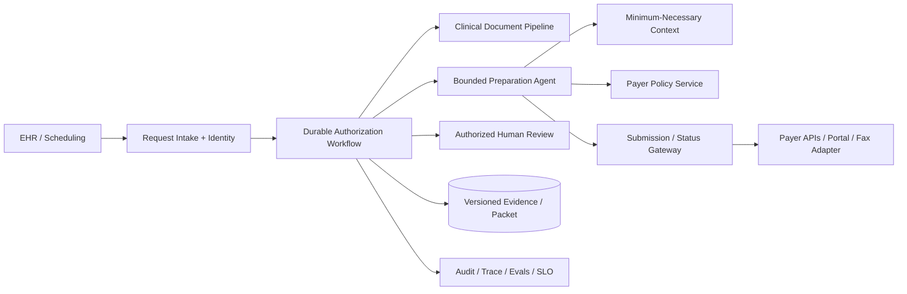

# Healthcare Prior-Authorization Preparation Agent

## Candidate prompt

Design an agent that helps a healthcare provider prepare and track prior-authorization requests. It gathers clinical documentation, checks payer requirements, identifies missing evidence, drafts a submission packet, and monitors status.

## Starting assumptions

Fictional design assumptions:

- 30,000 requests per month across several specialties and payers.
- Inputs include clinical notes, diagnoses, procedure codes, lab results, imaging reports, and payer policies.
- Some requests are routine; others are urgent.
- Payer responses may arrive through APIs, portals, fax, or human calls.
- The agent does not diagnose, select treatment, or independently attest to medical necessity.
- Authorized clinical and administrative staff review submissions.

## What to clarify

- Which specialty/procedure and payer are in v1?
- What is the user outcome: preparation, submission, tracking, appeal support?
- Who may review and attest?
- What is the urgent-request SLA?
- Which source is authoritative for eligibility and payer policy?
- Which channels permit automated submission?
- What data-retention, consent, and regional constraints apply?
- How are clinical-document amendments handled?

## Staged constraint reveals

### Reveal 1: Payer policy variability

Payer policies differ by plan and change frequently. A policy indexed last week no longer applies to today’s request.

Expected update:

- resolve payer, plan, procedure, jurisdiction, and effective date before policy retrieval;
- versioned/effective-dated policy artifacts;
- freshness and source-authority checks;
- deterministic checklist/rules where possible;
- retain policy snapshot and locator used for each requirement;
- explicit “policy unavailable/ambiguous” state;
- no unsupported model interpretation as final rule.

### Reveal 2: Sensitive context

A note contains unrelated behavioral-health history. The prior-authorization packet only needs orthopedic evidence.

Expected update:

- purpose-based minimum-necessary context;
- section/field-level selection and redaction;
- authorized user and service identity;
- no broad note copying into prompts or traces;
- protected artifact references;
- data-access audit and retention;
- separate clinical source from generated summary.

### Reveal 3: Urgent path

An urgent request must be submitted within 30 minutes, but the document-extraction queue is backed up.

Expected update:

- risk/urgency classification validated by policy/user;
- separate priority queue and reserved capacity;
- deterministic minimum packet path;
- progress visibility and human takeover;
- safe partial extraction with explicit gaps;
- no relaxed identity, evidence, or approval controls;
- SLO by urgency and queue-age alerts.

### Reveal 4: Human attestation

A clinician approves a draft. A later note amendment changes a key clinical fact before submission.

Expected update:

- approval binds to immutable packet and source versions;
- source-change event invalidates affected claims/attestation;
- material-diff detection;
- re-review required before submission;
- audit exact evidence and actor;
- no stale approved artifact silently sent.

## Strong answer signals

### Product boundary

The system assembles, checks, drafts, routes, and tracks. Clinical judgment, attestation, and treatment decisions stay with authorized professionals. Start with a narrow procedure/payer combination.

### Architecture

### State

- patient/request identity and purpose;
- payer/plan/procedure;
- urgency and deadline;
- required-evidence checklist;
- selected source facts with provenance;
- missing/conflicting evidence;
- packet and attestation versions;
- submission effect/status;
- callbacks and appeal state;
- policy/model/workflow versions.

### Effects

Submission is an external effect. Use an idempotency/request identity where supported, store payer confirmation IDs, and reconcile after timeouts. Fax/portal channels may require channel-specific deduplication and human review.

### Evals

- policy requirement retrieval;
- evidence checklist completeness;
- field/claim support;
- unnecessary sensitive-data inclusion;
- urgent SLO adherence;
- submission duplication;
- human correction;
- source-change invalidation;
- injection/privacy tests;
- denial reason feedback without treating payer outcome as perfect ground truth.

## Failure follow-ups

1. The payer portal has no API and changes its UI.
2. Two patients share the same name and birth month.
3. A payer status callback is delivered three times.
4. The request is denied for a reason not present in the published policy.
5. A clinician revokes approval after submission.
6. An operator needs to debug a trace without seeing the full clinical note.

## Scoring emphasis

| Dimension | Weight |
|---|---:|
| Human/clinical authority | 20% |
| Minimum-necessary data and privacy | 20% |
| Policy/evidence provenance | 20% |
| Durable urgent workflow/effects | 20% |
| Evals and audit | 10% |
| Scale and operations | 10% |

## Model outline

Use a durable request workflow, a purpose-limited clinical context service, versioned payer-policy retrieval, and a bounded preparation agent. Deterministic rules own required checklists where available. Every generated claim links to a selected source fact and policy locator. Human attestation binds to immutable packet/source versions and is invalidated by material change. Submission is idempotent or reconciled. Urgent work has reserved capacity but does not bypass privacy, evidence, or authority controls.
