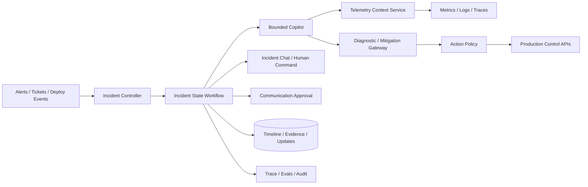

# Production Incident-Response Copilot

## Candidate prompt

Design an AI incident-response copilot for a large software company. It should correlate alerts, inspect telemetry, propose hypotheses, run safe diagnostics, draft updates, and optionally execute pre-approved reversible mitigations.

## Starting assumptions

Fictional assumptions:

- Thousands of services run across several regions.
- On-call engineers receive alerts from metrics, logs, traces, deploys, and customer tickets.
- Major incidents require fast coordination across teams.
- Telemetry may contain customer data and secrets.
- The copilot may execute only a narrow set of reversible actions.
- Humans own incident command and high-impact changes.

## What to clarify

- Which incident classes and services are in v1?
- What is a reversible action?
- What read and write systems exist?
- What latency matters during an active incident?
- Is the agent embedded in chat, an incident console, or both?
- How are runbooks and service ownership represented?
- What is the communication approval policy?
- How are simultaneous incidents isolated?

## Staged constraint reveals

### Reveal 1: Telemetry overload

An incident produces millions of log lines per minute. Relevant evidence is distributed across traces, deploy events, and one customer ticket.

Expected update:

- deterministic signal aggregation and anomaly/topology services before model;
- scoped query tools with time/service/tenant bounds;
- progressive hypothesis-driven retrieval;
- context summaries with links to raw evidence;
- query and token budgets;
- preserve timestamps and causality;
- no full-log stuffing.

### Reveal 2: Mitigation risk

Restarting a service is usually safe but can amplify an outage during a database failover.

Expected update:

- action preconditions from current system state;
- policy by service, incident class, dependency health, and blast radius;
- simulate/dry-run where possible;
- human approval for ambiguous/high-impact action;
- rate/concurrency limits;
- rollback and verification;
- model recommendation cannot override change freeze.

### Reveal 3: Communication hallucination

The copilot drafts a customer update claiming data loss before evidence exists.

Expected update:

- separate internal hypothesis from externally publishable facts;
- claim-level evidence and approved communication template;
- deterministic forbidden/required fields;
- human communications approval;
- artifact version and diff;
- model uncertainty preserved;
- external status post is an idempotent audited effect.

### Reveal 4: Copilot outage

The model provider is unavailable during the incident.

Expected update:

- incident system remains usable without model;
- deterministic dashboards, runbooks, search, and action controls;
- cached/locally available approved runbook content;
- validated fallback only for appropriate tasks;
- no dependency loop where the copilot is required to repair its own provider;
- graceful degradation and clear status.

## Strong answer signals

### Product boundary

The copilot accelerates evidence gathering, hypothesis management, and communication drafting. Incident command and material mitigations remain with authorized humans. Begin with one service family and read-heavy diagnostics.

### Architecture

### State

- incident ID, severity, services, regions;
- timeline and evidence links;
- hypotheses with supporting/refuting evidence;
- owners and roles;
- diagnostics and results;
- mitigation proposals/effects/verification;
- communication artifacts;
- deadlines and next update;
- model/tool/release versions.

### Tool controls

Read tools should constrain time range, service, region, fields, and result size. Write tools require incident scope, authenticated actor, policy decision, idempotency, rollback, and postcondition verification.

### Evals

- relevant-evidence retrieval;
- hypothesis support and calibration;
- incorrect causal-claim rate;
- required diagnostic sequence;
- prohibited mitigation rate;
- communication factuality;
- time to useful insight;
- on-call correction burden;
- provider-outage behavior;
- trace privacy.

### Observability

The copilot itself needs a separate health surface. During an incident, operators should know model/tool availability, stale context, blocked actions, spend, and whether the system is degraded.

## Failure follow-ups

1. Logs contain an API key and are captured in a trace.
2. Two incidents affect the same service and propose conflicting actions.
3. An on-call engineer manually changes production outside the copilot.
4. A mitigation succeeds but verification times out.
5. The incident chat contains a malicious copied webpage.
6. A postmortem later shows the initial hypothesis was wrong.

## Scoring emphasis

| Dimension | Weight |
|---|---:|
| Authority/action safety | 25% |
| Telemetry context and causality | 20% |
| Human workflow and communications | 15% |
| Observability/degraded mode | 15% |
| State/effects/recovery | 15% |
| Evals/privacy | 10% |

## Model outline

Build around an incident controller and explicit timeline, not a free-form chat. Deterministic telemetry services aggregate and scope data; the model manages bounded hypotheses and selects read diagnostics. A tool gateway and policy engine control reversible mitigations with preconditions, rate limits, approval, and verification. External communications use evidence-backed versioned artifacts and human approval. The incident workflow remains useful when the model is unavailable. Measure time to insight, evidence quality, unsafe proposals, human correction, action outcomes, and degraded-mode behavior.
