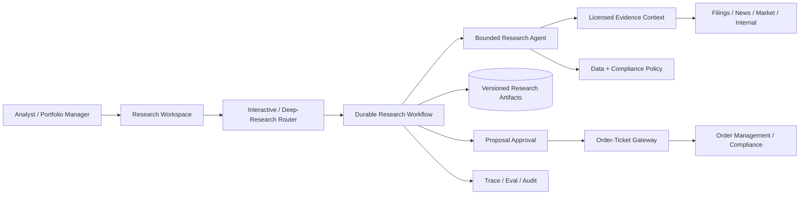

# Financial Research and Trade-Proposal Agent

## Candidate prompt

Design an agent for an investment firm that researches companies, synthesizes filings, market data, news, and internal notes, and prepares trade proposals for portfolio managers.

## Starting assumptions

Fictional assumptions:

- Users need both interactive questions and multi-hour deep research.
- Sources have different licenses, freshness, and authority.
- Internal research is confidential and team-scoped.
- The system may prepare an order ticket but cannot execute a trade autonomously.
- Market conditions can change between research and approval.

## What to clarify

- Which asset class and decision horizon?
- What is the difference between research, recommendation, and order preparation?
- Which data is real time versus delayed?
- Which sources may be quoted, cached, or shown to which users?
- What compliance checks and approvals exist?
- What is the acceptable stale-data window?
- Are personal trading and material nonpublic information controls in scope?
- How are corrections and model errors handled?

## Staged constraint reveals

### Reveal 1: Freshness mismatch

A filing is authoritative but months old. A social-media post is seconds old but unreliable. The agent merges them into one confident claim.

Expected update:

- source type, authority, publication/effective/retrieval time;
- distinguish fact, report, allegation, and model inference;
- temporal claim graph or evidence ledger;
- conflict/uncertainty preserved;
- task-specific freshness policy;
- no averaging into false certainty;
- cite exact source and timestamp.

### Reveal 2: Licensed data

Market-data contracts prohibit sending raw feed data to an external model provider or storing it beyond a short window.

Expected update:

- data inventory and license/purpose policy;
- local deterministic aggregation or approved model boundary;
- minimize and transform data before model access only if permitted;
- provider and region routing by data class;
- retention/deletion and cache restrictions;
- telemetry redaction;
- audit source usage.

### Reveal 3: Trade ticket

The portfolio manager approves a proposal, but price and position limits change before the order is submitted.

Expected update:

- proposal and order are distinct artifacts/states;
- approval binds to proposal version, assumptions, and expiry;
- recheck real-time price, exposure, liquidity, compliance, and account state immediately before creating order;
- material change requires re-approval;
- order creation idempotent/reconciled;
- no autonomous execution.

### Reveal 4: Evaluation

A model produces persuasive reports that portfolio managers like, but factual error rate increases slightly.

Expected update:

- user preference cannot override factual/safety gates;
- claim support/citation correctness;
- source coverage and conflict recall;
- factual error severity weighting;
- human correction and downstream decision tracking with caution about causality;
- holdout and incident sets;
- release block for high-severity errors.

## Strong answer signals

### Product boundary

The agent researches and prepares evidence-backed proposals. Authorized humans and existing trading/compliance systems own order approval and execution.

### Architecture

### Data/evidence model

Each fact records source, license class, authority, security scope, publication/effective/retrieval time, locator, and permitted use. Generated claims reference evidence IDs and label inference separately.

### Interactive versus deep research

Interactive questions have short bounded retrieval and latency budgets. Deep research is an asynchronous durable workflow with plans, parallel source tasks, checkpoints, progress, cancellation, and human clarification.

### Evals

- fact/citation correctness;
- temporal and source authority reasoning;
- conflict and uncertainty;
- data-license policy;
- internal ACLs;
- recommendation support;
- proposal freshness and approval integrity;
- persuasive-but-wrong adversarial cases;
- latency, cost, and analyst correction.

## Failure follow-ups

1. A news article is corrected after the report is published.
2. Internal notes contain material nonpublic information.
3. A user shares a report with a team lacking source-data entitlement.
4. The market closes while a deep-research workflow is running.
5. The order-management API times out after ticket creation.
6. Two sources refer to companies with the same ticker in different markets.

## Scoring emphasis

| Dimension | Weight |
|---|---:|
| Evidence/freshness/source authority | 25% |
| Data license and access governance | 20% |
| Proposal/order authority separation | 20% |
| Durable interactive/deep paths | 15% |
| Evals | 15% |
| Scale/operations | 5% |

## Model outline

Use an evidence service that preserves source authority, temporal metadata, license, and user entitlement. Route interactive and deep-research paths separately. The model may synthesize and infer, but claims must cite source evidence and label uncertainty. Research artifacts are immutable and versioned. Proposal approval expires or reopens when market/account/compliance state changes. Order-ticket creation passes through deterministic compliance and an idempotent gateway; trade execution remains outside the agent.
