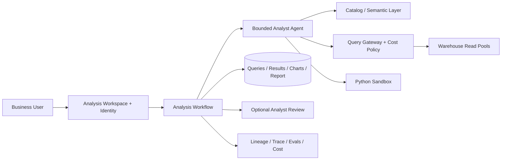

# Autonomous Data Analyst over an Enterprise Warehouse

## Candidate prompt

Design an agent that answers business questions by discovering datasets, generating and executing SQL or Python, validating results, producing charts, and saving a cited analysis.

## Starting assumptions

Fictional assumptions:

- The enterprise warehouse contains thousands of tables and several petabytes of data.
- Users have different row-, column-, and purpose-based permissions.
- Queries can be expensive.
- Some questions require multiple iterations and code execution.
- The agent may create reports but cannot modify production source data.
- Analysts need lineage and reproducibility.

## What to clarify

- Which user personas and domains are in v1?
- What semantic models, catalogs, and data-quality metadata exist?
- What query cost and latency limits apply?
- Can the agent access raw PII?
- What does a “correct” analysis mean?
- Are reports shareable beyond the user?
- How are derived datasets and notebooks governed?
- Is write-back ever required?

## Staged constraint reveals

### Reveal 1: Hallucinated schema

The model generates a valid query against the wrong revenue table and produces a plausible but incorrect result.

Expected update:

- governed catalog and semantic layer;
- typed schema discovery tools rather than model memory;
- source authority and owner metadata;
- metric definitions and grain/join constraints;
- query plan/lineage review;
- reference checks and reconciliation with known totals;
- ask clarification for ambiguous business terms.

### Reveal 2: Sensitive data

A marketing user asks for a customer-level export containing emails and health-related attributes.

Expected update:

- user/delegated identity and warehouse-native policies;
- purpose and row/column controls enforced at execution;
- no model-created bypass;
- aggregation/minimum-group policy where needed;
- output DLP and export restrictions;
- report sharing re-authorization;
- audit and zero-tolerance isolation tests.

### Reveal 3: Unsafe code

Generated Python attempts to install a package and connect to an external website.

Expected update:

- isolated ephemeral sandbox;
- no ambient credentials;
- egress denied by default;
- approved package/environment image;
- CPU/memory/time/disk limits;
- mounted data only through scoped artifacts or query API;
- output file scanning;
- kill and audit.

### Reveal 4: Cost explosion

A query scans hundreds of terabytes. Many users run similar exploratory jobs during quarter-end.

Expected update:

- dry-run/explain and estimated-cost gate;
- per-user/team/run budgets;
- query timeout and result limits;
- workload queue and warehouse pool isolation;
- sample/aggregate path;
- materialized/cache reuse with authorization/freshness;
- cancellation;
- chargeback/showback and cost SLO.

## Strong answer signals

### Product boundary

The agent analyzes through read-only governed interfaces and saves reproducible artifacts. It does not write production data. Ambiguous metric definitions require user clarification or authoritative semantic definitions.

### Architecture



### Analysis loop

```text
clarify question and decision context
→ resolve metric/dimensions/time/grain
→ discover authorized datasets
→ propose analysis plan
→ estimate query cost
→ execute read-only query
→ validate shape, quality, and known invariants
→ iterate within budget
→ generate chart/narrative
→ attach SQL/code/data snapshot references and lineage
→ save/share under authorization policy
```

### Validation

Use deterministic checks for row counts, nulls, joins, time range, units, duplicates, and known control totals. A second model critique may help, but it does not replace data-quality checks or a human for consequential decisions.

### Evals

- dataset/metric selection;
- SQL correctness and execution success;
- answer correctness on synthetic/reference datasets;
- join/grain errors;
- lineage completeness;
- privacy/export violations;
- unsafe code;
- cost budget;
- human analyst correction;
- reproducibility after data/version change.

## Failure follow-ups

1. The source table updates after the report is saved.
2. A dashboard metric and finance metric use different revenue definitions.
3. A query returns zero rows because an ACL filter is applied.
4. The sandbox process runs forever.
5. A user shares a report with someone who lacks source access.
6. Cached query results contain data from a deleted customer.

## Scoring emphasis

| Dimension | Weight |
|---|---:|
| Semantic correctness and lineage | 25% |
| Identity/data governance | 20% |
| Sandbox safety | 15% |
| Query cost/scale controls | 15% |
| Agent loop and validation | 15% |
| Evals/reproducibility | 10% |

## Model outline

Place a bounded analysis agent above a governed catalog/semantic layer, query gateway, and isolated Python sandbox. Warehouse policies enforce user and tenant access at execution. The agent resolves metric meaning and source authority before querying, estimates cost, and validates results with deterministic checks. Every report stores SQL/code, source versions, parameters, lineage, and artifact versions. Sharing rechecks authorization. Per-run budgets, warehouse pools, cancellation, and cache scope protect cost and fairness.
