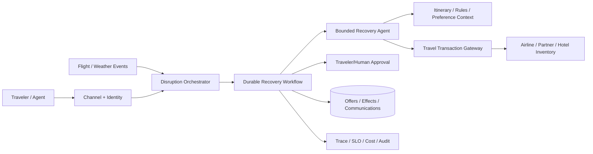

# Travel Disruption Recovery Agent

## Candidate prompt

Design an agent for an airline or travel platform that helps travelers recover from canceled or delayed trips. It should find alternatives, rebook eligible itineraries, arrange hotels or ground transport, and keep travelers informed.

## Starting assumptions

Fictional assumptions:

- Normal traffic is moderate, but storms create 50× bursts.
- Itineraries can include multiple passengers, partner airlines, connections, hotels, and special-assistance requirements.
- Availability and price change rapidly.
- Rebooking, cancellation, and voucher issuance are real external effects.
- Travelers can approve options through mobile, web, SMS, or an airport agent.

## What to clarify

- Airline-only or broader travel platform?
- Which disruption types and fare rules are in scope?
- What can be automatic under the contract of carriage?
- How are passenger identity and consent verified?
- What latency matters during a disruption?
- How are families and special needs handled?
- Which partner systems support holds or idempotency?
- What happens when a partial itinerary succeeds?

## Staged constraint reveals

### Reveal 1: Rapidly changing inventory

The agent shows an option, the traveler approves it, and the seat disappears before booking.

Expected update:

- search result is not a commitment;
- short-lived offer/hold token where available;
- price/availability revalidation immediately before effect;
- approval bound to itinerary, price range, and expiry;
- alternative ranking and transparent change;
- no silent booking of a materially different option;
- fast replan within a bounded loop.

### Reveal 2: Partial transaction

The outbound flight rebooks, but the partner return flight fails. The API times out before the agent knows whether a hotel voucher was issued.

Expected update:

- saga-like state with each effect and system-of-record ID;
- idempotency and reconciliation per provider;
- compensation/supersession policy;
- do not assume atomic cross-provider transaction;
- human escalation for inconsistent itinerary;
- clear customer communication;
- durable workflow.

### Reveal 3: Family preferences

A traveler previously asked for aisle seats. The current trip includes a toddler and requires adjacent seats; the old preference conflicts with the immediate need.

Expected update:

- explicit trip constraints outrank long-term preference;
- memory provenance, scope, and conflict handling;
- critical assistance/family constraints modeled deterministically;
- user confirmation for tradeoffs;
- avoid inferring sensitive needs from unrelated history.

### Reveal 4: Storm overload

A major hub closes. Search and model providers rate-limit, while travelers need immediate status.

Expected update:

- deterministic disruption/status path and push notifications;
- priority by departure time, vulnerability/special assistance, and stranded status according to policy;
- queues, admission, fairness, and callback;
- cached network-level advisories with version/expiry;
- precomputed reaccommodation options where possible;
- bulkheads per partner;
- graceful degradation without weakening transaction checks.

## Strong answer signals

### Architecture



### Workflow

```text
detect disruption and affected travelers
→ determine contractual options and constraints
→ search/hold alternatives
→ rank with explicit tradeoffs
→ request approval with expiry
→ revalidate
→ execute per-provider effects
→ reconcile partial/uncertain outcomes
→ arrange secondary services
→ communicate exact confirmed state
→ continue monitoring until stable
```

### State and memory

Track passenger/itinerary, fare rules, assistance constraints, options and expiries, approvals, each provider effect, compensation, communication versions, and long-term preferences with provenance.

### Evals

- valid itinerary and constraint satisfaction;
- price/availability revalidation;
- duplicate/partial effect handling;
- preference conflict;
- communication accuracy;
- time to first useful option;
- successful recovery and human intervention;
- overload fairness;
- privacy/injection;
- partner outage behavior.

## Failure follow-ups

1. A traveler approves through SMS after the app already booked another option.
2. One passenger in a group accepts a different route.
3. A passport/visa constraint makes a connection invalid.
4. A partner sends an out-of-order cancellation event.
5. A voucher is issued twice.
6. A traveler cancels while a booking call is in progress.

## Scoring emphasis

| Dimension | Weight |
|---|---:|
| Transaction/effect semantics | 25% |
| Fast-changing state and approval | 20% |
| Durable partial-failure workflow | 20% |
| Scale/fairness/degradation | 15% |
| Memory and user constraints | 10% |
| Evals/communication | 10% |

## Model outline

Use a durable saga-like recovery workflow with a bounded planning agent and a deterministic rules/constraint layer. Search results are expiring offers, not facts. Approval binds to exact option and tolerances, followed by revalidation. Each external provider effect has its own idempotency/reconciliation/compensation state; cross-provider atomicity is not assumed. Explicit trip constraints override governed long-term preferences. During storms, deterministic status and queued recovery remain available when models or partners degrade.
