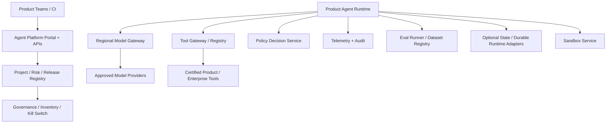

# Enterprise Agent Platform for Multiple Product Teams

## Candidate prompt

Design an internal platform that lets many product teams build and operate AI agents safely. The platform should provide model access, tool integration, state, evaluation, observability, policy, and deployment controls without forcing every team into one workflow framework.

## Starting assumptions

Fictional assumptions:

- 100 product teams plan to launch agents over two years.
- Use cases range from internal research to customer support and cloud operations.
- Teams use Python, TypeScript, and several orchestration frameworks.
- The enterprise has multiple regions, business units, and compliance tiers.
- A central AI platform team has 20 engineers and cannot review every prompt manually.
- Teams must be able to move quickly without receiving broad credentials.

## What to clarify

- Which capabilities must be centralized versus optional libraries?
- Who owns application outcomes and incidents?
- What risk tiers and approval processes exist?
- Is the platform runtime, SDK, gateway, control plane, or all of them?
- Which providers and deployment models are allowed?
- How is tenant/project identity represented?
- What is the minimum viable platform for the first five teams?
- How will adoption and platform success be measured?

## Staged constraint reveals

### Reveal 1: Framework diversity

Some teams need durable workflows; others only need a low-latency tool-calling API. One team wants to bring a custom agent runtime.

Expected update:

- define stable contracts at model, tool, policy, telemetry, identity, and eval boundaries;
- do not centralize every orchestration abstraction;
- reference runtime/adapters rather than mandatory framework where possible;
- certification/conformance tests;
- risk-tier requirements independent of SDK;
- paved paths plus escape hatch with ownership.

### Reveal 2: Tool marketplace

Teams want to publish tools for others. One tool uses a broad service account and returns customer data from any tenant.

Expected update:

- tool registry is not automatic trust;
- owner, schema, version, risk, identity mode, scopes, data classes, residency, SLO, cost, audit, and deprecation metadata;
- security review/certification by risk;
- delegated identity where possible;
- tenant enforcement in downstream system;
- runtime policy and capability allowlist;
- kill switch and usage inventory.

### Reveal 3: Central outage

The shared model gateway fails. All agents, including incident-response tools, stop working.

Expected update:

- define platform availability tiers;
- regionalized/data-plane design;
- client degradation/fallback contracts;
- avoid making low-risk deterministic functionality depend on the model gateway;
- bulkheads and quotas;
- emergency provider route with validated constraints;
- platform dogfooding without circular dependency.

### Reveal 4: Accountability

A customer-facing agent causes harm. The product team says the platform approved the model; the platform team says the product owned the prompt.

Expected update:

- explicit shared-responsibility model;
- product owner for outcome, data, authority, and runbooks;
- platform owner for gateway/runtime controls and service SLOs;
- centrally enforced minimum gates by risk;
- immutable release metadata and audit;
- incident coordination and change ownership;
- no “certified model” treated as application safety.

## Strong answer signals

### Platform product boundary

Centralize scarce, high-leverage controls:

- model gateway and approved providers;
- identity and project/tenant registry;
- tool contracts/registry/gateway;
- policy and authority hooks;
- telemetry conventions and trace backend;
- eval dataset/runner primitives;
- secrets, quotas, cost, and audit;
- reference durable runtime and sandbox adapters;
- release metadata and inventory.

Leave product-specific user journey, state machine, prompts, tool choices, eval cases, SLOs, and incidents with the product team under platform minimums.

### Architecture

### Multi-tenancy

Use organization/project/environment/tenant identity. Apply it to credentials, quotas, storage, tool calls, traces, datasets, cost, and support access. High-cardinality run IDs remain in traces, not metric labels.

### Developer experience

- local emulator and deterministic model/tool fakes;
- typed SDKs and HTTP contracts;
- sample applications and reference architectures;
- one-command trace/eval;
- CI conformance suite;
- self-service project/tool registration;
- clear errors and policy explanations;
- migration/version policy;
- golden paths by risk tier.

### Governance

Risk-tier controls may require:

- approved model/data route;
- tool review;
- human approval for material actions;
- security/adversarial evals;
- tenant isolation tests;
- SLO/runbook/owner;
- canary and rollback;
- data inventory and retention;
- incident reporting.

### Platform metrics

- time to first safe production release;
- adoption and active projects;
- percentage using paved paths;
- eval/trace coverage;
- cost and quota efficiency;
- platform availability;
- policy violations prevented;
- incident distribution and recovery;
- developer satisfaction;
- duplicated infrastructure removed.

Avoid measuring only model-call volume.

## Failure follow-ups

1. A team bypasses the tool gateway and calls a database directly.
2. A tool contract changes incompatibly while 30 agents depend on it.
3. One project floods the shared eval service.
4. A region prohibits sending data to one provider.
5. Teams disagree on trace schemas.
6. A central policy update blocks a critical workflow.
7. A product team wants to persist raw prompts forever for debugging.
8. The platform must support an acquired company with a separate identity system.

## Scoring emphasis

| Dimension | Weight |
|---|---:|
| Central versus product ownership | 25% |
| Identity/tool/policy platform controls | 20% |
| Extensibility and developer experience | 15% |
| Multi-tenant reliability and scale | 15% |
| Governance/shared responsibility | 15% |
| Evals/observability/economics | 10% |

## Model outline

Design a thin but enforceable platform control plane around stable contracts, not one mandatory agent framework. Centralize model/tool gateways, identity, policy hooks, telemetry, eval primitives, sandboxing, quotas, release inventory, and kill switches. Offer reference runtimes and adapters. Product teams own their user outcome, workflow, prompts, tool choices, domain evals, SLOs, and incidents while satisfying risk-tier minimums. Tool registration includes identity, data, effect, SLO, version, and owner metadata. Regional data planes and bulkheads prevent one shared failure from stopping the enterprise.
