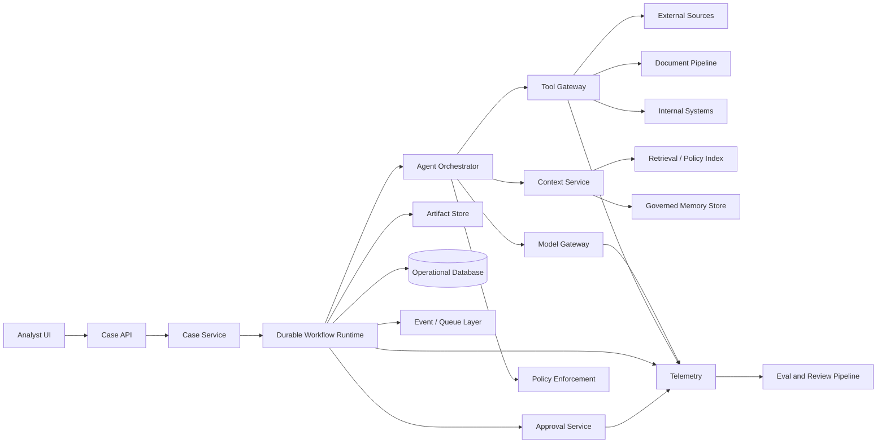

# Capstone Brief: Atlas

## Scenario

A bank onboards thousands of corporate counterparties and vendors. Analysts currently collect registration data, sanctions results, ownership records, uploaded documents, adverse-media evidence, and internal risk policy manually. The work is slow, evidence is inconsistent, and cases are difficult to audit.

Build **Atlas**, an agentic system that assembles an evidence-backed due-diligence packet for a human risk analyst.

Atlas may research, extract, compare, summarize, ask for missing information, and prepare a recommendation. It may not make the final onboarding, rejection, account closure, or sanctions disposition decision.

## Users

### Primary

- Counterparty risk analyst
- Compliance reviewer
- Operations specialist

### Secondary

- Audit and model-risk teams
- Platform/SRE team
- Security and privacy teams
- Business owner

## Required user journey

1. An analyst starts a case with an entity name, jurisdiction, requested relationship, and any available documents.
2. Atlas resolves the legal entity and records ambiguity.
3. Atlas collects registration, ownership, sanctions, internal relationship, document, and adverse-media evidence.
4. Atlas detects missing or conflicting information.
5. Atlas may draft a request for missing documentation.
6. Atlas evaluates evidence against a versioned policy.
7. Atlas creates a cited case packet containing:
   - entity resolution;
   - evidence inventory;
   - risk signals;
   - conflicts;
   - unresolved questions;
   - source freshness;
   - confidence by claim;
   - suggested next action.
8. A human reviews, edits, approves publication, or sends the case back for more work.
9. The packet and all decisions are versioned and auditable.
10. Selected cases are sampled for evaluation and operational review.

## Course assumptions

These are fictional design constraints used consistently across labs. Learners may challenge them if they explain the tradeoff.

| Constraint | Target |
|---|---|
| Daily cases | 20,000 |
| Peak concurrent active cases | 500 |
| Interactive status update | First progress signal within 2 seconds |
| Standard case completion | P95 under 10 minutes |
| Long-running cases | Up to 30 days while waiting for documents |
| Availability | 99.9% for case intake and status |
| Evidence freshness | Configurable by source; sanctions no older than 24 hours |
| Cost | Median variable cost below $0.80 per standard case; hard autonomous budget $4.00 |
| Data | Confidential business data and personal information |
| Tenancy | Multiple business units; strict tenant and case isolation |
| Human decision | Mandatory before official case publication and any material outcome |

## Tools

Implement stubs first, then replace them selectively.

### Read-only tools

- `resolve_entity`
- `get_corporate_registry_record`
- `screen_sanctions`
- `get_ownership_graph`
- `search_adverse_media`
- `extract_uploaded_document`
- `retrieve_internal_relationships`
- `retrieve_policy`
- `get_case_artifact`

### Side-effecting tools

- `request_missing_document`
- `create_analyst_review_task`
- `save_draft_packet`
- `publish_case_packet`
- `cancel_case`
- `record_human_decision`

Every side-effecting tool must support an idempotency key and expose its effect status.

## Output contract

```json
{
  "case_id": "case_...",
  "entity": {
    "legal_name": "Example Holdings Ltd.",
    "jurisdiction": "GB",
    "registration_id": "12345678",
    "resolution_confidence": 0.93,
    "alternatives": []
  },
  "evidence": [
    {
      "claim_id": "claim_...",
      "claim": "The entity was incorporated in 2018.",
      "source_id": "src_...",
      "source_type": "corporate_registry",
      "retrieved_at": "2026-08-26T12:00:00Z",
      "effective_at": "2026-08-26T00:00:00Z",
      "citation": "registry://GB/12345678/incorporation-date"
    }
  ],
  "risk_signals": [
    {
      "signal": "Potential ownership conflict",
      "severity": "medium",
      "policy_rule_id": "POL-OWN-014",
      "evidence_claim_ids": ["claim_1", "claim_2"],
      "confidence": 0.74
    }
  ],
  "conflicts": [],
  "unresolved_questions": [],
  "recommended_next_action": "human_review",
  "policy_version": "kyc-policy-2026-08",
  "agent_run_id": "run_...",
  "status": "draft"
}
```

The schema is an application contract. The model must not be the only validator.

## Reference architecture



## Component responsibilities

### Case API and service

- authenticates users;
- enforces tenant and case authorization;
- accepts idempotent case creation;
- provides status and artifact APIs;
- does not execute model loops in the request thread.

### Durable workflow runtime

- owns case progress;
- persists waits, retries, timers, and external signals;
- prevents loss of progress across worker crashes and deploys;
- keeps non-deterministic external effects in activities/tasks;
- supports cancellation, compensation, and workflow versioning.

### Agent orchestrator

- chooses among allowed research and synthesis steps;
- reads explicit state;
- enforces budgets and stop conditions;
- delegates deterministic checks to code;
- emits structured decisions and proposed tool calls.

### Model gateway

- provider-neutral request contract;
- model selection and fallback;
- prompt and schema versions;
- timeout and retry policy;
- token, cost, and latency accounting;
- content handling controls.

### Tool gateway

- validates schemas;
- resolves service/delegated identity;
- enforces scopes and risk policy;
- applies idempotency, timeouts, retries, and rate limits;
- normalizes error semantics;
- records effects and audit metadata.

### Context service

- retrieves only authorized evidence;
- prioritizes sources by authority and freshness;
- separates instructions from untrusted content;
- assembles a bounded context package;
- records provenance and citation identifiers.

### Approval service

- stores the proposed action, evidence, diff, risk, requester, expiry, and policy reason;
- supports approve, edit, reject, request-more-information, and escalate;
- resumes the exact workflow instance;
- prevents self-approval where separation of duties is required.

### Policy enforcement

- enforces non-negotiable rules outside model text;
- maps tools and actions to authority tiers;
- checks source freshness and required evidence;
- denies prohibited autonomous decisions.

### Eval and review pipeline

- runs offline regression on version changes;
- samples production traces;
- evaluates final outcomes and intermediate trajectories;
- routes uncertain or high-risk cases to human adjudication;
- converts incidents into permanent test cases.

## Required failure injections

The capstone is not complete until the learner demonstrates these failures:

1. Model returns malformed or schema-invalid output.
2. A source times out and later recovers.
3. A tool performs its effect but the acknowledgment is lost.
4. A worker crashes after three minutes of progress.
5. A human approval arrives two days later.
6. The same case-start request is delivered twice.
7. A retrieved webpage contains indirect prompt injection.
8. A user from Tenant A attempts to retrieve Tenant B evidence.
9. A model version increases cost and reduces citation correctness.
10. A deployment changes workflow code while old cases are still running.
11. A sanctions source is stale.
12. A loop reaches its token or iteration budget.

## Required capstone deliverables

- one-page RUNTIME design canvas;
- context and trust-boundary diagram;
- sequence diagram for the normal path;
- sequence diagram for crash and resume;
- tool catalog with authority and idempotency;
- state and memory schema;
- threat model and risk register;
- eval dataset with at least 30 cases;
- trace instrumentation;
- SLO and alert specification;
- load and cost report;
- deployment and rollback plan;
- live demo;
- five-minute architecture defense;
- repository README explaining tradeoffs.

## Definition of done

Atlas is done when a reviewer can:

- start a case;
- watch progress;
- inspect cited evidence;
- see unresolved conflicts;
- interrupt and resume work;
- approve or reject a proposed publication;
- replay the trace;
- verify that duplicate delivery does not duplicate the side effect;
- run the regression suite;
- see cost, latency, and quality metrics;
- recover a case after a simulated crash;
- understand why the system does not delegate the final decision.
